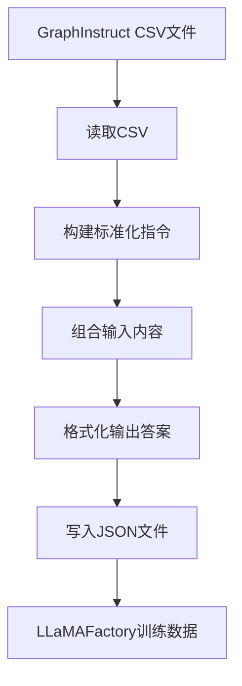
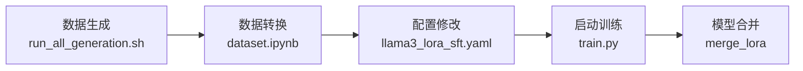

# 模型训练集成

<cite>
**本文档中引用的文件**   
- [README.md](file://README.md)
- [LLaMAFactory/README.md](file://LLaMAFactory/README.md)
- [LLaMAFactory/examples/train_reasoning/llama3_lora_sft.yaml](file://LLaMAFactory/examples/train_reasoning/llama3_lora_sft.yaml)
- [LLaMAFactory/examples/merge_reasoning/llama3_lora_sft.yaml](file://LLaMAFactory/examples/merge_reasoning/llama3_lora_sft.yaml)
- [LLaMAFactory/src/train.py](file://LLaMAFactory/src/train.py)
- [LLaMAFactory/data/dataset_info.json](file://LLaMAFactory/data/dataset_info.json)
- [LLaMAFactory/data/dataset.ipynb](file://LLaMAFactory/data/dataset.ipynb)
- [GTG/generation.py](file://GTG/generation.py)
- [GTG/process_node_id/main.py](file://GTG/process_node_id/main.py)
</cite>

## 目录
1. [简介](#简介)
2. [数据准备与格式转换](#数据准备与格式转换)
3. [训练配置详解](#训练配置详解)
4. [模型训练与合并工作流](#模型训练与合并工作流)
5. [集成点总结](#集成点总结)

## 简介
本文档旨在说明如何将GraphInstruct项目生成的数据集用于大语言模型的训练。GraphInstruct是一个用于评估大语言模型图理解与推理能力的基准。其生成的数据集可以用于在LLaMAFactory框架下进行监督微调（SFT），以训练出具备图推理能力的模型（如论文中提到的GraphSolver和GraphSolver+）。本文档将详细介绍从数据生成、格式转换、配置修改到启动训练的完整工作流。

**Section sources**
- [README.md](file://README.md#L3-L48)

## 数据准备与格式转换
GraphInstruct生成的原始数据为CSV格式，而LLaMAFactory的SFT任务需要alpaca或sharegpt等JSON格式。因此，必须进行数据格式转换。

### 数据生成
GraphInstruct通过其`GTG`模块生成数据。核心脚本`GTG/generation.py`负责生成各种图任务（如BFS、DFS、最短路径等）的样本。生成的数据包含图结构、问题和答案等信息。用户可以通过运行`script/run_all_generation.sh`脚本来生成所有任务的数据集，生成的CSV文件位于`GTG/data/dataset`目录下。

**Section sources**
- [GTG/generation.py](file://GTG/generation.py#L11-L82)
- [README.md](file://README.md#L20-L27)

### 节点ID处理
为了增加任务难度，GraphInstruct提供了`process_node_id`模块，可以将图中的节点ID从整数（int_id）转换为字母（letter_id）。该过程由`GTG/process_node_id/main.py`脚本执行，它读取原始CSV文件，应用映射规则，并输出新的CSV文件。

**Section sources**
- [GTG/process_node_id/main.py](file://GTG/process_node_id/main.py#L9-L47)

### CSV到JSON的转换
LLaMAFactory提供了一个Jupyter Notebook脚本`LLaMAFactory/data/dataset.ipynb`来完成从GraphInstruct的CSV格式到LLaMAFactory支持的JSON格式的转换。该脚本的核心函数`convert_csv_to_json_letter`或`convert_csv_to_json_steps`会执行以下操作：
1.  **读取CSV文件**：加载包含图任务数据的CSV文件。
2.  **构建指令**：根据任务类型（如判断、数值、列表、元组）构建一个标准化的指令（`instruction`）。指令会明确要求模型将答案格式化为`<<<ANSWER>>>`的形式。
3.  **构造输入**：将图的自然语言描述（`graph_nl`）和具体问题（`question`）组合成输入（`input`）。
4.  **构造输出**：将答案（`answer`）用`<<<>>>`包裹，形成输出（`output`）。
5.  **写入JSON文件**：将转换后的`instruction`、`input`、`output`三元组写入JSON文件，供LLaMAFactory使用。



**Diagram sources**
- [LLaMAFactory/data/dataset.ipynb](file://LLaMAFactory/data/dataset.ipynb#L554-L566)

**Section sources**
- [LLaMAFactory/data/dataset.ipynb](file://LLaMAFactory/data/dataset.ipynb#L554-L566)

### 数据集注册
转换后的JSON数据集需要在`LLaMAFactory/data/dataset_info.json`中进行注册，以便LLaMAFactory能够识别和加载。注册信息包括数据集名称、文件路径和列名映射。例如，`BFS-reason`数据集的注册信息如下：
```json
"BFS-reason": {
    "file_name": "LLaMA-Factory/data/reasoning/BFS-int_id/train.json",
    "columns": {
      "prompt": "instruction",
      "query": "input",
      "response": "output"
    }
}
```
这告诉LLaMAFactory，`instruction`列对应模型的提示（prompt），`input`列对应查询（query），`output`列对应模型的响应（response）。

**Section sources**
- [LLaMAFactory/data/dataset_info.json](file://LLaMAFactory/data/dataset_info.json#L9-L15)

## 训练配置详解
LLaMAFactory使用YAML配置文件来定义训练任务的所有参数。对于GraphInstruct的SFT任务，核心配置文件是`examples/train_reasoning/llama3_lora_sft.yaml`。

### 核心配置项
- **模型配置** (`model`): 指定基础模型的路径（`model_name_or_path`）。
- **方法配置** (`method`): 
  - `stage: sft` 指定任务类型为监督微调。
  - `finetuning_type: lora` 指定使用LoRA进行参数高效微调。
  - `lora_rank` 和 `lora_target` 定义了LoRA适配器的秩和目标层。
- **数据集配置** (`dataset`): 
  - `dataset: common_neighbor-reason, connectivity-reason, ...` 列出在`dataset_info.json`中注册的、要用于训练的数据集名称。
  - `template: llama3` 指定使用的聊天模板，必须与基础模型匹配。
  - `cutoff_len` 定义了输入序列的最大长度。
- **输出配置** (`output`): 
  - `output_dir` 指定了训练过程中保存检查点的目录。
- **训练配置** (`train`): 
  - `per_device_train_batch_size` 和 `gradient_accumulation_steps` 共同决定了全局批量大小。
  - `learning_rate` 和 `num_train_epochs` 控制训练的优化过程。

**Section sources**
- [LLaMAFactory/examples/train_reasoning/llama3_lora_sft.yaml](file://LLaMAFactory/examples/train_reasoning/llama3_lora_sft.yaml#L1-L48)

## 模型训练与合并工作流
完整的训练工作流包括数据准备、模型训练和模型合并三个主要阶段。

### 工作流步骤
1.  **数据生成**：运行`script/run_all_generation.sh`生成原始CSV数据。
2.  **数据转换**：使用`LLaMAFactory/data/dataset.ipynb`将CSV数据转换为JSON格式，并注册到`dataset_info.json`。
3.  **配置修改**：编辑`examples/train_reasoning/llama3_lora_sft.yaml`，设置`model_name_or_path`为你的基础模型路径，并根据需要调整`output_dir`等参数。
4.  **启动训练**：进入`LLaMAFactory`目录，运行`bash run.sh`或直接使用`llamafactory-cli train`命令启动训练。训练脚本`src/train.py`会加载配置并执行SFT任务。
5.  **合并模型**：训练完成后，使用合并配置文件（如`examples/merge_reasoning/llama3_lora_sft.yaml`）将LoRA适配器权重合并到基础模型中，生成一个独立的、可直接推理的模型。



**Diagram sources**
- [LLaMAFactory/examples/train_reasoning/llama3_lora_sft.yaml](file://LLaMAFactory/examples/train_reasoning/llama3_lora_sft.yaml#L2-L28)
- [LLaMAFactory/examples/merge_reasoning/llama3_lora_sft.yaml](file://LLaMAFactory/examples/merge_reasoning/llama3_lora_sft.yaml#L4-L5)
- [LLaMAFactory/src/train.py](file://LLaMAFactory/src/train.py#L18-L19)

**Section sources**
- [README.md](file://README.md#L57-L64)
- [LLaMAFactory/examples/merge_reasoning/llama3_lora_sft.yaml](file://LLaMAFactory/examples/merge_reasoning/llama3_lora_sft.yaml#L1-L14)

## 集成点总结
GraphInstruct与LLaMAFactory的集成主要体现在以下几个关键点：
1.  **数据格式桥接**：GraphInstruct生成的CSV数据通过`dataset.ipynb`脚本被转换为LLaMAFactory支持的Alpaca风格JSON格式，这是集成的基础。
2.  **数据集注册**：转换后的数据集在`dataset_info.json`中注册，使LLaMAFactory的训练器能够通过名称（如`BFS-reason`）加载数据。
3.  **配置驱动训练**：LLaMAFactory的YAML配置文件（如`llama3_lora_sft.yaml`）将数据集名称、模型路径和训练超参数统一管理，实现了从数据到模型的无缝连接。
4.  **标准化工作流**：整个流程遵循“生成-转换-配置-训练-合并”的标准化工作流，确保了实验的可复现性。