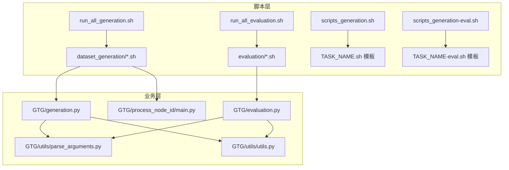
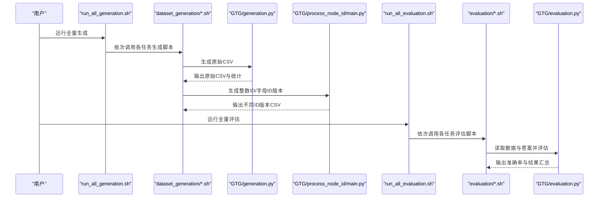
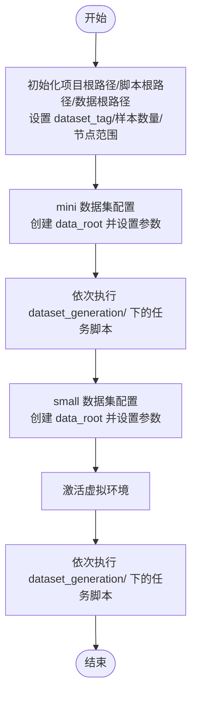
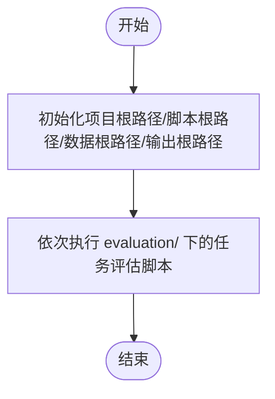
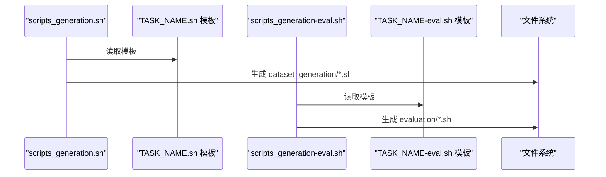
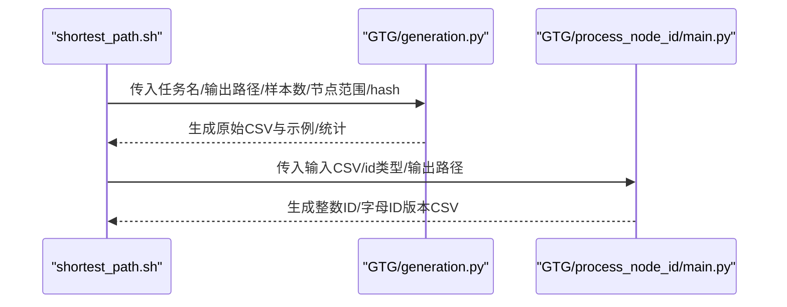
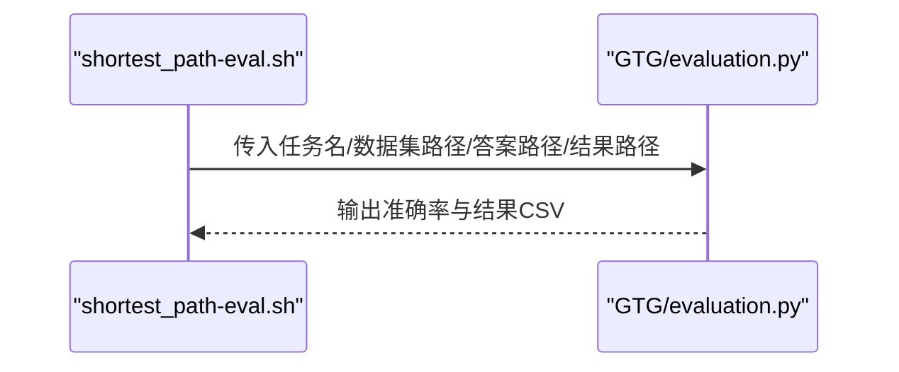
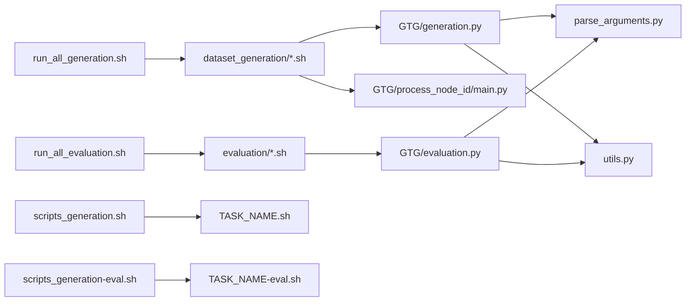

# 批量处理脚本

<cite>
**本文引用的文件**
- [run_all_generation.sh](file://script/run_all_generation.sh)
- [run_all_evaluation.sh](file://script/run_all_evaluation.sh)
- [scripts_generation.sh](file://script/meta_generation/scripts_generation.sh)
- [scripts_generation-eval.sh](file://script/meta_generation/scripts_generation-eval.sh)
- [TASK_NAME.sh](file://script/meta_generation/TASK_NAME.sh)
- [TASK_NAME-eval.sh](file://script/meta_generation/TASK_NAME-eval.sh)
- [shortest_path.sh](file://script/dataset_generation/shortest_path.sh)
- [shortest_path-eval.sh](file://script/evaluation/shortest_path-eval.sh)
- [generation.py](file://GTG/generation.py)
- [evaluation.py](file://GTG/evaluation.py)
- [process_node_id/main.py](file://GTG/process_node_id/main.py)
- [parse_arguments.py](file://GTG/utils/parse_arguments.py)
- [utils.py](file://GTG/utils/utils.py)
</cite>

## 目录
1. [引言](#引言)
2. [项目结构](#项目结构)
3. [核心组件](#核心组件)
4. [架构总览](#架构总览)
5. [详细组件分析](#详细组件分析)
6. [依赖关系分析](#依赖关系分析)
7. [性能考量](#性能考量)
8. [故障排查指南](#故障排查指南)
9. [结论](#结论)
10. [附录](#附录)

## 引言
本文件聚焦于两个核心批量处理脚本：run_all_generation.sh 与 run_all_evaluation.sh。前者负责遍历并依次执行 dataset_generation/ 目录下的全部任务生成脚本，一键生成全量数据集；后者负责协调调用 evaluation/ 目录下的评估脚本，对多任务模型输出进行自动化批量评估。文档将从系统架构、执行逻辑、错误处理与日志输出、使用场景与CI/CD集成、可定制化修改等方面进行深入说明，并通过图示帮助读者快速理解各组件之间的关系与数据流。

## 项目结构
围绕批量处理脚本的关键目录与文件如下：
- script/run_all_generation.sh：全量生成入口，按固定顺序依次调用 dataset_generation/ 下的任务脚本。
- script/run_all_evaluation.sh：全量评估入口，按固定顺序依次调用 evaluation/ 下的评估脚本。
- script/meta_generation/scripts_generation.sh：自动生成 dataset_generation/ 下的单任务生成脚本。
- script/meta_generation/scripts_generation-eval.sh：自动生成 evaluation/ 下的单任务评估脚本。
- script/meta_generation/TASK_NAME.sh：生成脚本模板。
- script/meta_generation/TASK_NAME-eval.sh：评估脚本模板。
- script/dataset_generation/*.sh：具体任务的生成脚本集合。
- script/evaluation/*.sh：具体任务的评估脚本集合。
- GTG/generation.py：生成器主程序，负责按任务模块生成样本并保存。
- GTG/evaluation.py：评估器主程序，负责读取答案与数据集并计算指标。
- GTG/process_node_id/main.py：节点ID映射处理器，将原始ID转换为整数或字母ID。
- GTG/utils/parse_arguments.py：统一参数解析。
- GTG/utils/utils.py：通用工具函数（随机种子、格式化、图表示等）。

图表来源
- [run_all_generation.sh](file://script/run_all_generation.sh#L1-L72)
- [run_all_evaluation.sh](file://script/run_all_evaluation.sh#L1-L32)
- [scripts_generation.sh](file://script/meta_generation/scripts_generation.sh#L1-L33)
- [scripts_generation-eval.sh](file://script/meta_generation/scripts_generation-eval.sh#L1-L33)
- [TASK_NAME.sh](file://script/meta_generation/TASK_NAME.sh#L1-L36)
- [TASK_NAME-eval.sh](file://script/meta_generation/TASK_NAME-eval.sh#L1-L14)
- [generation.py](file://GTG/generation.py#L1-L107)
- [evaluation.py](file://GTG/evaluation.py#L1-L73)
- [process_node_id/main.py](file://GTG/process_node_id/main.py#L1-L58)
- [parse_arguments.py](file://GTG/utils/parse_arguments.py#L1-L28)
- [utils.py](file://GTG/utils/utils.py#L1-L200)

章节来源
- [run_all_generation.sh](file://script/run_all_generation.sh#L1-L72)
- [run_all_evaluation.sh](file://script/run_all_evaluation.sh#L1-L32)
- [scripts_generation.sh](file://script/meta_generation/scripts_generation.sh#L1-L33)
- [scripts_generation-eval.sh](file://script/meta_generation/scripts_generation-eval.sh#L1-L33)
- [TASK_NAME.sh](file://script/meta_generation/TASK_NAME.sh#L1-L36)
- [TASK_NAME-eval.sh](file://script/meta_generation/TASK_NAME-eval.sh#L1-L14)

## 核心组件
- run_all_generation.sh：定义项目根路径、数据根路径、数据集标签、样本数量与节点范围等全局配置，随后按顺序调用 dataset_generation/ 下的每个任务脚本，完成全量数据集生成。
- run_all_evaluation.sh：定义项目根路径、数据根路径、输出根路径等，按顺序调用 evaluation/ 下的每个任务评估脚本，完成全量评估。
- 生成脚本模板与自动生成：通过 scripts_generation.sh 与 TASK_NAME.sh 模板，批量生成 dataset_generation/ 下的单任务生成脚本；通过 scripts_generation-eval.sh 与 TASK_NAME-eval.sh 模板，批量生成 evaluation/ 下的单任务评估脚本。
- 生成器与评估器：GTG/generation.py 负责按任务模块生成样本、保存CSV并输出统计；GTG/evaluation.py 负责读取答案与数据集、逐条评估并输出准确率与结果汇总；GTG/process_node_id/main.py 将生成的图与文本中的节点ID映射为整数或字母ID，便于下游评估。

章节来源
- [run_all_generation.sh](file://script/run_all_generation.sh#L1-L72)
- [run_all_evaluation.sh](file://script/run_all_evaluation.sh#L1-L32)
- [scripts_generation.sh](file://script/meta_generation/scripts_generation.sh#L1-L33)
- [scripts_generation-eval.sh](file://script/meta_generation/scripts_generation-eval.sh#L1-L33)
- [TASK_NAME.sh](file://script/meta_generation/TASK_NAME.sh#L1-L36)
- [TASK_NAME-eval.sh](file://script/meta_generation/TASK_NAME-eval.sh#L1-L14)
- [generation.py](file://GTG/generation.py#L1-L107)
- [evaluation.py](file://GTG/evaluation.py#L1-L73)
- [process_node_id/main.py](file://GTG/process_node_id/main.py#L1-L58)

## 架构总览
下图展示了批量生成与评估的整体流程：run_all_generation.sh 作为编排入口，依次调用 dataset_generation/ 的单任务生成脚本；每个生成脚本内部会调用 GTG/generation.py 生成原始CSV，并通过 GTG/process_node_id/main.py 生成整数ID与字母ID两种版本；run_all_evaluation.sh 同样作为编排入口，依次调用 evaluation/ 的单任务评估脚本，评估器读取对应任务的数据与答案，输出评估结果。

图表来源
- [run_all_generation.sh](file://script/run_all_generation.sh#L1-L72)
- [run_all_evaluation.sh](file://script/run_all_evaluation.sh#L1-L32)
- [generation.py](file://GTG/generation.py#L1-L107)
- [evaluation.py](file://GTG/evaluation.py#L1-L73)
- [process_node_id/main.py](file://GTG/process_node_id/main.py#L1-L58)

## 详细组件分析

### run_all_generation.sh 分析
- 全局配置：设置项目根路径、脚本根路径、数据根路径、数据集标签、样本数量与节点范围等。
- 数据集分组：通过 dataset_tag 区分 mini 与 small 两套数据集，分别创建对应的 data_root 并设置不同的 num_nodes_range 与 num_sample。
- 任务执行顺序：按固定顺序依次调用 dataset_generation/ 下的各个任务脚本，形成稳定的全量生成流水线。
- 环境准备：在 small 数据集阶段激活虚拟环境，确保依赖可用。
- 日志与输出：生成脚本内部通过 Python 主程序打印配置与示例，最终输出 CSV 文件与描述性统计文件。

图表来源
- [run_all_generation.sh](file://script/run_all_generation.sh#L1-L72)

章节来源
- [run_all_generation.sh](file://script/run_all_generation.sh#L1-L72)

### run_all_evaluation.sh 分析
- 全局配置：设置项目根路径、脚本根路径、数据根路径、输出根路径等。
- 任务执行顺序：按固定顺序依次调用 evaluation/ 下的各个任务评估脚本。
- 可扩展性：当前注释掉部分任务，便于按需启用特定任务的评估。
- 日志与输出：评估脚本内部通过 Python 主程序读取数据与答案，输出准确率与结果汇总文件。

图表来源
- [run_all_evaluation.sh](file://script/run_all_evaluation.sh#L1-L32)

章节来源
- [run_all_evaluation.sh](file://script/run_all_evaluation.sh#L1-L32)

### 自动生成脚本与模板
- scripts_generation.sh：维护一个任务名称列表，遍历后基于 TASK_NAME.sh 模板生成 dataset_generation/ 下的单任务生成脚本。
- scripts_generation-eval.sh：维护一个任务名称列表，遍历后基于 TASK_NAME-eval.sh 模板生成 evaluation/ 下的单任务评估脚本。
- 模板文件：TASK_NAME.sh 与 TASK_NAME-eval.sh 提供了标准化的生成与评估脚本骨架，包括参数传递、文件命名、调用主程序等。

图表来源
- [scripts_generation.sh](file://script/meta_generation/scripts_generation.sh#L1-L33)
- [scripts_generation-eval.sh](file://script/meta_generation/scripts_generation-eval.sh#L1-L33)
- [TASK_NAME.sh](file://script/meta_generation/TASK_NAME.sh#L1-L36)
- [TASK_NAME-eval.sh](file://script/meta_generation/TASK_NAME-eval.sh#L1-L14)

章节来源
- [scripts_generation.sh](file://script/meta_generation/scripts_generation.sh#L1-L33)
- [scripts_generation-eval.sh](file://script/meta_generation/scripts_generation-eval.sh#L1-L33)
- [TASK_NAME.sh](file://script/meta_generation/TASK_NAME.sh#L1-L36)
- [TASK_NAME-eval.sh](file://script/meta_generation/TASK_NAME-eval.sh#L1-L14)

### 单任务生成脚本（以 shortest_path.sh 为例）
- 参数接收：从命令行接收 data_root、num_nodes_range、num_sample、dataset_tag。
- 目录与文件：为任务创建子目录，输出原始 CSV 文件。
- 生成流程：调用 GTG/generation.py 生成样本并保存；随后调用 GTG/process_node_id/main.py 生成整数ID与字母ID两种版本。
- 输出产物：原始 CSV、统计描述文件、整数ID CSV、字母ID CSV。

图表来源
- [shortest_path.sh](file://script/dataset_generation/shortest_path.sh#L1-L36)
- [generation.py](file://GTG/generation.py#L1-L107)
- [process_node_id/main.py](file://GTG/process_node_id/main.py#L1-L58)

章节来源
- [shortest_path.sh](file://script/dataset_generation/shortest_path.sh#L1-L36)
- [generation.py](file://GTG/generation.py#L1-L107)
- [process_node_id/main.py](file://GTG/process_node_id/main.py#L1-L58)

### 单任务评估脚本（以 shortest_path-eval.sh 为例）
- 参数接收：从命令行接收 data_root、output_root。
- 文件定位：根据任务名定位数据集（整数ID版本）与答案文件，输出结果文件。
- 评估流程：调用 GTG/evaluation.py 读取数据与答案，逐条评估并输出准确率与结果汇总。

图表来源
- [shortest_path-eval.sh](file://script/evaluation/shortest_path-eval.sh#L1-L14)
- [evaluation.py](file://GTG/evaluation.py#L1-L73)

章节来源
- [shortest_path-eval.sh](file://script/evaluation/shortest_path-eval.sh#L1-L14)
- [evaluation.py](file://GTG/evaluation.py#L1-L73)

### 参数解析与工具函数
- 参数解析：parse_arguments.py 统一解析 --task、--file_*、--seed、--hash_str、--num_nodes_range、--num_samples 等参数，供生成与评估主程序使用。
- 工具函数：utils.py 提供随机种子设置、样本展示、ID格式化、图表示转换、哈希映射等通用能力，支撑生成与评估过程的稳定性与一致性。

章节来源
- [parse_arguments.py](file://GTG/utils/parse_arguments.py#L1-L28)
- [utils.py](file://GTG/utils/utils.py#L1-L200)

## 依赖关系分析
- 脚本到模块：run_all_generation.sh 与 run_all_evaluation.sh 依赖 dataset_generation/ 与 evaluation/ 下的具体脚本；具体脚本再依赖 GTG/generation.py、GTG/evaluation.py、GTG/process_node_id/main.py。
- 模块到工具：生成与评估主程序依赖 GTG/utils/parse_arguments.py 与 GTG/utils/utils.py。
- 自动化生成：scripts_generation.sh 与 scripts_generation-eval.sh 通过模板文件生成具体脚本，降低重复劳动并保持一致性。

图表来源
- [run_all_generation.sh](file://script/run_all_generation.sh#L1-L72)
- [run_all_evaluation.sh](file://script/run_all_evaluation.sh#L1-L32)
- [generation.py](file://GTG/generation.py#L1-L107)
- [evaluation.py](file://GTG/evaluation.py#L1-L73)
- [process_node_id/main.py](file://GTG/process_node_id/main.py#L1-L58)
- [parse_arguments.py](file://GTG/utils/parse_arguments.py#L1-L28)
- [utils.py](file://GTG/utils/utils.py#L1-L200)
- [scripts_generation.sh](file://script/meta_generation/scripts_generation.sh#L1-L33)
- [scripts_generation-eval.sh](file://script/meta_generation/scripts_generation-eval.sh#L1-L33)
- [TASK_NAME.sh](file://script/meta_generation/TASK_NAME.sh#L1-L36)
- [TASK_NAME-eval.sh](file://script/meta_generation/TASK_NAME-eval.sh#L1-L14)

## 性能考量
- 顺序执行：当前脚本采用顺序串行执行，简单可靠但可能无法充分利用多核资源。若需加速，可在保证数据一致性前提下引入并行策略（例如按任务分组并行、限制并发度）。
- I/O 与中间文件：生成阶段会产生大量中间CSV与统计文件，建议定期清理或归档，避免磁盘压力。
- 随机性与可复现：生成器通过哈希映射种子，确保相同任务+标签组合的可复现性；评估阶段依赖固定合并顺序，建议在CI中固定任务顺序以保证结果可比对。
- 虚拟环境：small 数据集阶段激活虚拟环境，确保依赖一致；建议在本地与CI中统一Python环境与依赖版本。

## 故障排查指南
- 任务失败是否中断整体流程：
  - 当前 run_all_generation.sh 与 run_all_evaluation.sh 中未显式设置错误中断（如 set -e），因此单个任务失败不会自动中断后续任务的执行。若需严格中断，请在相应脚本中添加错误处理逻辑（例如在 bash 调用后检查返回码并在失败时退出）。
- 常见问题定位：
  - 路径配置：确认 project_root、data_root、output_root 是否正确指向目标位置。
  - 虚拟环境：small 数据集阶段需要激活虚拟环境，若报依赖缺失，先激活环境再重试。
  - 权限与目录：确保 data_root 与 output_root 存在且具备写权限。
  - 任务顺序：若仅需运行特定任务，可在 run_all_generation.sh 或 run_all_evaluation.sh 中注释掉不需要的任务行，或复制对应脚本到独立脚本中单独执行。
- 日志输出：
  - 生成脚本内部会打印配置与示例样本，最终输出 CSV 与统计文件；评估脚本会打印准确率并输出结果汇总文件。建议在 CI 中收集这些文件以便审计。

章节来源
- [run_all_generation.sh](file://script/run_all_generation.sh#L1-L72)
- [run_all_evaluation.sh](file://script/run_all_evaluation.sh#L1-L32)
- [generation.py](file://GTG/generation.py#L1-L107)
- [evaluation.py](file://GTG/evaluation.py#L1-L73)

## 结论
run_all_generation.sh 与 run_all_evaluation.sh 通过标准化的脚本模板与严格的执行顺序，实现了从数据生成到评估的端到端自动化。配合 scripts_generation.sh 与 scripts_generation-eval.sh，能够快速扩展新任务并保持一致性。在实际使用中，建议结合 CI/CD 流程，将这两个脚本作为流水线的关键步骤，以提升效率与可重复性。同时，针对错误处理与并行优化，可根据团队需求进一步增强。

## 附录

### 使用场景与CI/CD集成建议
- 在 CI 中分阶段执行：
  - 阶段一：运行 run_all_generation.sh 生成全量数据集，上传生成的 CSV 与统计文件。
  - 阶段二：运行 run_all_evaluation.sh 对模型输出进行评估，收集准确率与结果汇总。
- 选择性执行：
  - 若仅需某几个任务，可在 run_all_generation.sh 或 run_all_evaluation.sh 中注释掉不需要的任务行，或将对应脚本复制到独立脚本中单独执行。
- 任务顺序调整：
  - 由于脚本按固定顺序执行，若需调整顺序，直接修改 run_all_generation.sh 或 run_all_evaluation.sh 中的调用顺序即可。
- 错误中断与告警：
  - 建议在脚本中增加 set -e 与错误检查，确保失败时及时终止并触发告警。

### 修改与定制化指南
- 修改生成参数：在 run_all_generation.sh 中调整 dataset_tag、data_root、num_sample、num_nodes_range 等参数，以适配不同规模与质量要求的数据集。
- 添加新任务：
  - 使用 scripts_generation.sh 与 scripts_generation-eval.sh 生成新的单任务脚本模板，然后在 run_all_generation.sh 与 run_all_evaluation.sh 中加入对应调用行。
- 环境隔离：
  - 在 run_all_generation.sh 中按需激活虚拟环境，确保依赖一致；在 CI 中统一镜像与依赖版本。
- 日志与报告：
  - 生成与评估脚本均输出CSV与统计文件，建议在 CI 中收集并归档，便于后续分析与回溯。