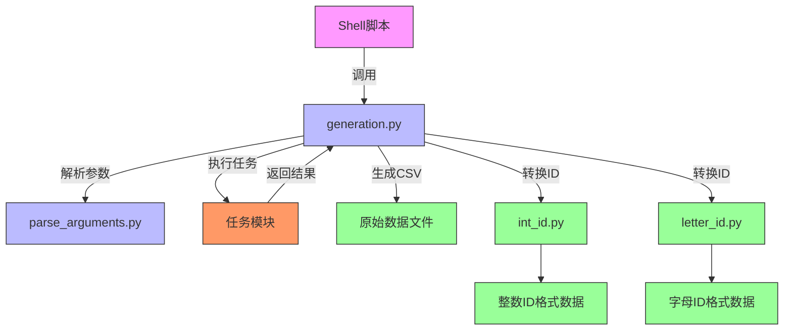
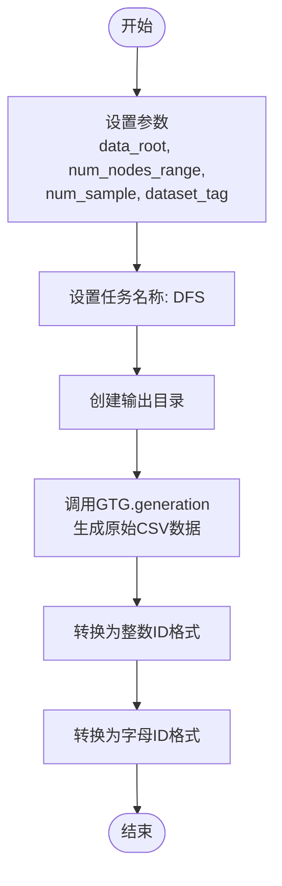
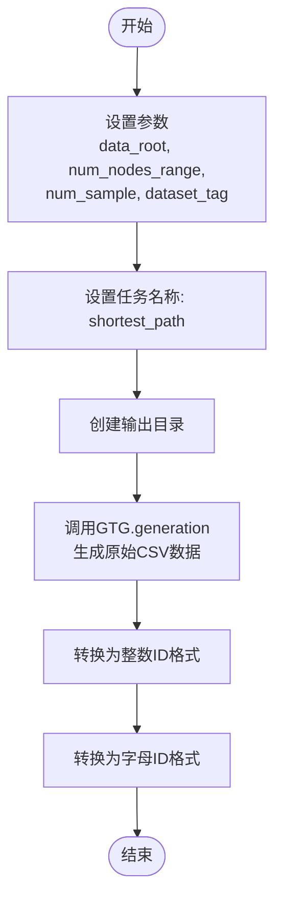

# 数据生成脚本

<cite>
**本文档中引用的文件**  
- [BFS.sh](file://script/dataset_generation/BFS.sh)
- [DFS.sh](file://script/dataset_generation/DFS.sh)
- [MST.sh](file://script/dataset_generation/MST.sh)
- [shortest_path.sh](file://script/dataset_generation/shortest_path.sh)
- [bipartite.sh](file://script/dataset_generation/bipartite.sh)
- [clustering_coefficient.sh](file://script/dataset_generation/clustering_coefficient.sh)
- [common_neighbor.sh](file://script/dataset_generation/common_neighbor.sh)
- [connected_component.sh](file://script/dataset_generation/connected_component.sh)
- [connectivity.sh](file://script/dataset_generation/connectivity.sh)
- [cycle.sh](file://script/dataset_generation/cycle.sh)
- [degree.sh](file://script/dataset_generation/degree.sh)
- [diameter.sh](file://script/dataset_generation/diameter.sh)
- [edge.sh](file://script/dataset_generation/edge.sh)
- [euler_path.sh](file://script/dataset_generation/euler_path.sh)
- [hamiltonian_path.sh](file://script/dataset_generation/hamiltonian_path.sh)
- [jaccard.sh](file://script/dataset_generation/jaccard.sh)
- [neighbor.sh](file://script/dataset_generation/neighbor.sh)
- [page_rank.sh](file://script/dataset_generation/page_rank.sh)
- [predecessor.sh](file://script/dataset_generation/predecessor.sh)
- [topological_sort.sh](file://script/dataset_generation/topological_sort.sh)
- [generation.py](file://GTG/generation.py)
- [parse_arguments.py](file://GTG/utils/parse_arguments.py)
- [BFS.py](file://GTG/tasks/BFS/BFS.py)
- [DFS.py](file://GTG/tasks/DFS/DFS.py)
- [MST.py](file://GTG/tasks/MST/MST.py)
- [shortest_path.py](file://GTG/tasks/shortest_path/shortest_path.py)
- [bipartite.py](file://GTG/tasks/bipartite/bipartite.py)
- [clustering_coefficient.py](file://GTG/tasks/clustering_coefficient/clustering_coefficient.py)
- [common_neighbor.py](file://GTG/tasks/common_neighbor/common_neighbor.py)
- [connected_component.py](file://GTG/tasks/connected_component/connected_component.py)
- [connectivity.py](file://GTG/tasks/connectivity/connectivity.py)
- [cycle.py](file://GTG/tasks/cycle/cycle.py)
- [degree.py](file://GTG/tasks/degree/degree.py)
- [diameter.py](file://GTG/tasks/diameter/diameter.py)
- [edge.py](file://GTG/tasks/edge/edge.py)
- [euler_path.py](file://GTG/tasks/euler_path/euler_path.py)
- [hamiltonian_path.py](file://GTG/tasks/hamiltonian_path/hamiltonian_path.py)
- [jaccard.py](file://GTG/tasks/jaccard/jaccard.py)
- [neighbor.py](file://GTG/tasks/neighbor/neighbor.py)
- [page_rank.py](file://GTG/tasks/page_rank/page_rank.py)
- [predecessor.py](file://GTG/tasks/predecessor/predecessor.py)
- [topological_sort.py](file://GTG/tasks/topological_sort/topological_sort.py)
</cite>

## 目录
1. [简介](#简介)
2. [项目结构](#项目结构)
3. [核心组件](#核心组件)
4. [架构概述](#架构概述)
5. [详细组件分析](#详细组件分析)
6. [依赖分析](#依赖分析)
7. [性能考虑](#性能考虑)
8. [故障排除指南](#故障排除指南)
9. [结论](#结论)

## 简介
本项目包含一系列用于生成图论任务数据集的shell脚本，每个脚本对应一个特定的图论问题（如BFS、DFS、最短路径等）。这些脚本通过调用Python模块`GTG.generation`主程序，结合任务特定的实现模块（位于`GTG/tasks/`目录下），生成结构化的CSV格式数据集。脚本支持灵活的参数配置，包括图的规模、样本数量和数据集标签，并通过`GTG/utils/parse_arguments.py`进行参数解析。生成的原始数据会进一步处理为整数ID和字母ID两种格式，以适应不同的应用场景。

## 项目结构
数据生成脚本位于`script/dataset_generation/`目录下，每个脚本对应一个图论任务。这些脚本统一调用`GTG/generation.py`作为主生成程序，并依赖`GTG/tasks/`目录下的任务特定模块实现具体的图生成和问题求解逻辑。`GTG/utils/parse_arguments.py`提供统一的参数解析功能，确保所有脚本遵循一致的命令行接口规范。

```mermaid
graph TB
subgraph "数据生成脚本"
BFS[BFS.sh]
DFS[DFS.sh]
MST[MST.sh]
SP[shortest_path.sh]
BP[bipartite.sh]
CC[clustering_coefficient.sh]
CN[common_neighbor.sh]
CO[connected_component.sh]
CT[connectivity.sh]
CY[cycle.sh]
DE[degree.sh]
DI[diameter.sh]
ED[edge.sh]
EP[euler_path.sh]
HP[hamiltonian_path.sh]
JA[jaccard.sh]
NE[neighbor.sh]
PR[page_rank.sh]
PD[predecessor.sh]
TS[topological_sort.sh]
end
subgraph "Python模块"
GEN[generation.py]
PARSE[parse_arguments.py]
BFS_PY[BFS.py]
DFS_PY[DFS.py]
MST_PY[MST.py]
SP_PY[shortest_path.py]
BP_PY[bipartite.py]
CC_PY[clustering_coefficient.py]
CN_PY[common_neighbor.py]
CO_PY[connected_component.py]
CT_PY[connectivity.py]
CY_PY[cycle.py]
DE_PY[degree.py]
DI_PY[diameter.py]
ED_PY[edge.py]
EP_PY[euler_path.py]
HP_PY[hamiltonian_path.py]
JA_PY[jaccard.py]
NE_PY[neighbor.py]
PR_PY[page_rank.py]
PD_PY[predecessor.py]
TS_PY[topological_sort.py]
end
subgraph "节点ID处理器"
INT[int_id.py]
LETTER[letter_id.py]
MAIN[main.py]
end
BFS --> GEN
DFS --> GEN
MST --> GEN
SP --> GEN
BP --> GEN
CC --> GEN
CN --> GEN
CO --> GEN
CT --> GEN
CY --> GEN
DE --> GEN
DI --> GEN
ED --> GEN
EP --> GEN
HP --> GEN
JA --> GEN
NE --> GEN
PR --> GEN
PD --> GEN
TS --> GEN
GEN --> PARSE
GEN --> BFS_PY
GEN --> DFS_PY
GEN --> MST_PY
GEN --> SP_PY
GEN --> BP_PY
GEN --> CC_PY
GEN --> CN_PY
GEN --> CO_PY
GEN --> CT_PY
GEN --> CY_PY
GEN --> DE_PY
GEN --> DI_PY
GEN --> ED_PY
GEN --> EP_PY
GEN --> HP_PY
GEN --> JA_PY
GEN --> NE_PY
GEN --> PR_PY
GEN --> PD_PY
GEN --> TS_PY
GEN --> INT
GEN --> LETTER
GEN --> MAIN
```

**图源**  
- [BFS.sh](file://script/dataset_generation/BFS.sh)
- [generation.py](file://GTG/generation.py)
- [parse_arguments.py](file://GTG/utils/parse_arguments.py)
- [BFS.py](file://GTG/tasks/BFS/BFS.py)
- [int_id.py](file://GTG/process_node_id/int_id.py)
- [letter_id.py](file://GTG/process_node_id/letter_id.py)

**节源**  
- [script/dataset_generation/](file://script/dataset_generation/)
- [GTG/generation.py](file://GTG/generation.py)

## 核心组件
所有数据生成脚本共享相同的核心结构：接收四个命令行参数（数据根目录、节点数范围、样本数量、数据集标签），设置任务名称和输出路径，调用`GTG.generation`主程序生成原始CSV数据，然后分别使用整数ID和字母ID两种格式对原始数据进行转换处理。这种设计确保了所有脚本的一致性和可维护性。

**节源**  
- [BFS.sh](file://script/dataset_generation/BFS.sh#L1-L36)
- [DFS.sh](file://script/dataset_generation/DFS.sh#L1-L36)
- [MST.sh](file://script/dataset_generation/MST.sh#L1-L36)

## 架构概述
整个数据生成系统的架构分为三层：shell脚本层、Python主程序层和任务实现层。shell脚本作为用户接口，负责接收参数并组织工作流；`generation.py`作为主控制器，负责解析参数、调用任务模块和协调数据处理；`GTG/tasks/`下的各个Python模块实现具体的图生成和问题求解算法。`GTG/utils/parse_arguments.py`为第二层和第三层提供统一的参数解析服务。

**图源**  
- [generation.py](file://GTG/generation.py)
- [parse_arguments.py](file://GTG/utils/parse_arguments.py)
- [BFS.py](file://GTG/tasks/BFS/BFS.py)

## 详细组件分析
每个数据生成脚本都遵循相同的执行流程，体现了高度的代码复用和一致性。脚本首先定义任务名称，创建相应的输出目录，然后调用主生成程序生成原始数据，最后对数据进行ID格式转换。

### BFS脚本分析
`BFS.sh`脚本用于生成广度优先搜索任务的数据集。它调用`GTG/tasks/BFS/BFS.py`模块实现具体的BFS算法和图生成逻辑。

**图源**  
- [BFS.sh](file://script/dataset_generation/BFS.sh#L1-L36)
- [BFS.py](file://GTG/tasks/BFS/BFS.py)

**节源**  
- [BFS.sh](file://script/dataset_generation/BFS.sh#L1-L36)
- [BFS.py](file://GTG/tasks/BFS/BFS.py)

### DFS脚本分析
`DFS.sh`脚本用于生成深度优先搜索任务的数据集。其执行流程与BFS脚本完全一致，仅任务名称和调用的Python模块不同。

**图源**  
- [DFS.sh](file://script/dataset_generation/DFS.sh#L1-L36)
- [DFS.py](file://GTG/tasks/DFS/DFS.py)

**节源**  
- [DFS.sh](file://script/dataset_generation/DFS.sh#L1-L36)
- [DFS.py](file://GTG/tasks/DFS/DFS.py)

### 最短路径脚本分析
`shortest_path.sh`脚本用于生成最短路径任务的数据集。该脚本同样遵循标准流程，调用`GTG/tasks/shortest_path/shortest_path.py`模块。

**图源**  
- [shortest_path.sh](file://script/dataset_generation/shortest_path.sh#L1-L36)
- [shortest_path.py](file://GTG/tasks/shortest_path/shortest_path.py)

**节源**  
- [shortest_path.sh](file://script/dataset_generation/shortest_path.sh#L1-L36)
- [shortest_path.py](file://GTG/tasks/shortest_path/shortest_path.py)

## 依赖分析
数据生成脚本系统具有清晰的依赖关系。所有shell脚本都依赖于`GTG/generation.py`主程序，而主程序又依赖于`GTG/utils/parse_arguments.py`进行参数解析和`GTG/tasks/`下的具体任务模块。此外，所有脚本都使用`GTG/process_node_id/main.py`进行ID格式转换。

```mermaid
graph TD
BFS_S[BFS.sh] --> GEN[generation.py]
DFS_S[DFS.sh] --> GEN
MST_S[MST.sh] --> GEN
SP_S[shortest_path.sh] --> GEN
BP_S[bipartite.sh] --> GEN
CC_S[clustering_coefficient.sh] --> GEN
CN_S[common_neighbor.sh] --> GEN
CO_S[connected_component.sh] --> GEN
CT_S[connectivity.sh] --> GEN
CY_S[cycle.sh] --> GEN
DE_S[degree.sh] --> GEN
DI_S[diameter.sh] --> GEN
ED_S[edge.sh] --> GEN
EP_S[euler_path.sh] --> GEN
HP_S[hamiltonian_path.sh] --> GEN
JA_S[jaccard.sh] --> GEN
NE_S[neighbor.sh] --> GEN
PR_S[page_rank.sh] --> GEN
PD_S[predecessor.sh] --> GEN
TS_S[topological_sort.sh] --> GEN
GEN --> PARSE[parse_arguments.py]
GEN --> BFS_M[BFS.py]
GEN --> DFS_M[DFS.py]
GEN --> MST_M[MST.py]
GEN --> SP_M[shortest_path.py]
GEN --> BP_M[bipartite.py]
GEN --> CC_M[clustering_coefficient.py]
GEN --> CN_M[common_neighbor.py]
GEN --> CO_M[connected_component.py]
GEN --> CT_M[connectivity.py]
GEN --> CY_M[cycle.py]
GEN --> DE_M[degree.py]
GEN --> DI_M[diameter.py]
GEN --> ED_M[edge.py]
GEN --> EP_M[euler_path.py]
GEN --> HP_M[hamiltonian_path.py]
GEN --> JA_M[jaccard.py]
GEN --> NE_M[neighbor.py]
GEN --> PR_M[page_rank.py]
GEN --> PD_M[predecessor.py]
GEN --> TS_M[topological_sort.py]
GEN --> INT_M[int_id.py]
GEN --> LETTER_M[letter_id.py]
GEN --> MAIN_M[main.py]
```

**图源**  
- [BFS.sh](file://script/dataset_generation/BFS.sh)
- [generation.py](file://GTG/generation.py)
- [parse_arguments.py](file://GTG/utils/parse_arguments.py)
- [BFS.py](file://GTG/tasks/BFS/BFS.py)
- [int_id.py](file://GTG/process_node_id/int_id.py)

**节源**  
- [script/dataset_generation/](file://script/dataset_generation/)
- [GTG/](file://GTG/)

## 性能考虑
由于所有脚本都遵循相同的执行模式，性能主要取决于`GTG.generation`主程序和各个任务模块的实现效率。图的规模（`num_nodes_range`）和样本数量（`num_sample`）是影响生成时间的主要因素。建议根据实际需求合理设置这些参数，避免生成过大规模的数据集导致内存不足或执行时间过长。ID格式转换过程是独立的，可以并行执行以提高效率。

## 故障排除指南
在使用这些数据生成脚本时，可能会遇到以下常见问题：

1. **依赖缺失**：确保Python环境中已安装所有必需的依赖包，特别是`networkx`等图论计算库。
2. **参数格式错误**：检查传递给脚本的四个参数是否正确，特别是`num_nodes_range`应为类似"10-20"的字符串格式。
3. **路径权限问题**：确保脚本有权限在指定的`data_root`目录下创建子目录和文件。
4. **Python模块导入错误**：确保工作目录正确，能够正确导入`GTG`包。

调试建议：首先运行一个小型测试（如`num_nodes_range=5-10`, `num_sample=5`），验证脚本基本功能正常，然后逐步增加规模。

**节源**  
- [BFS.sh](file://script/dataset_generation/BFS.sh#L1-L36)
- [generation.py](file://GTG/generation.py)
- [parse_arguments.py](file://GTG/utils/parse_arguments.py)

## 结论
`script/dataset_generation/`目录下的所有shell脚本构成了一个统一、可扩展的数据生成系统。通过标准化的接口和模块化的设计，这些脚本能够高效地为各种图论任务生成训练和评估数据集。系统的分层架构确保了良好的可维护性和可扩展性，新任务的添加只需实现相应的Python模块并创建一个简单的shell脚本即可。