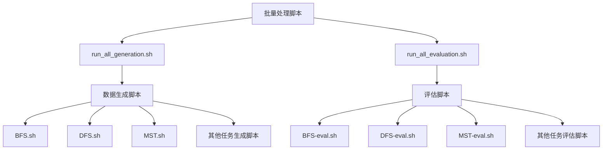

# 脚本使用指南

<cite>
**本文档中引用的文件**   
- [BFS.sh](file://script/dataset_generation/BFS.sh)
- [DFS.sh](file://script/dataset_generation/DFS.sh)
- [MST.sh](file://script/dataset_generation/MST.sh)
- [bipartite.sh](file://script/dataset_generation/bipartite.sh)
- [clustering_coefficient.sh](file://script/dataset_generation/clustering_coefficient.sh)
- [common_neighbor.sh](file://script/dataset_generation/common_neighbor.sh)
- [connected_component.sh](file://script/dataset_generation/connected_component.sh)
- [connectivity.sh](file://script/dataset_generation/connectivity.sh)
- [cycle.sh](file://script/dataset_generation/cycle.sh)
- [degree.sh](file://script/dataset_generation/degree.sh)
- [diameter.sh](file://script/dataset_generation/diameter.sh)
- [edge.sh](file://script/dataset_generation/edge.sh)
- [euler_path.sh](file://script/dataset_generation/euler_path.sh)
- [hamiltonian_path.sh](file://script/dataset_generation/hamiltonian_path.sh)
- [jaccard.sh](file://script/dataset_generation/jaccard.sh)
- [maximum_flow.sh](file://script/dataset_generation/maximum_flow.sh)
- [neighbor.sh](file://script/dataset_generation/neighbor.sh)
- [page_rank.sh](file://script/dataset_generation/page_rank.sh)
- [predecessor.sh](file://script/dataset_generation/predecessor.sh)
- [shortest_path.sh](file://script/dataset_generation/shortest_path.sh)
- [topological_sort.sh](file://script/dataset_generation/topological_sort.sh)
- [BFS-eval.sh](file://script/evaluation/BFS-eval.sh)
- [DFS-eval.sh](file://script/evaluation/DFS-eval.sh)
- [MST-eval.sh](file://script/evaluation/MST-eval.sh)
- [bipartite-eval.sh](file://script/evaluation/bipartite-eval.sh)
- [clustering_coefficient-eval.sh](file://script/evaluation/clustering_coefficient-eval.sh)
- [common_neighbor-eval.sh](file://script/evaluation/common_neighbor-eval.sh)
- [connected_component-eval.sh](file://script/evaluation/connected_component-eval.sh)
- [connectivity-eval.sh](file://script/evaluation/connectivity-eval.sh)
- [cycle-eval.sh](file://script/evaluation/cycle-eval.sh)
- [degree-eval.sh](file://script/evaluation/degree-eval.sh)
- [diameter-eval.sh](file://script/evaluation/diameter-eval.sh)
- [edge-eval.sh](file://script/evaluation/edge-eval.sh)
- [euler_path-eval.sh](file://script/evaluation/euler_path-eval.sh)
- [hamiltonian_path-eval.sh](file://script/evaluation/hamiltonian_path-eval.sh)
- [jaccard-eval.sh](file://script/evaluation/jaccard-eval.sh)
- [maximum_flow-eval.sh](file://script/evaluation/maximum_flow-eval.sh)
- [neighbor-eval.sh](file://script/evaluation/neighbor-eval.sh)
- [page_rank-eval.sh](file://script/evaluation/page_rank-eval.sh)
- [predecessor-eval.sh](file://script/evaluation/predecessor-eval.sh)
- [shortest_path-eval.sh](file://script/evaluation/shortest_path-eval.sh)
- [topological_sort-eval.sh](file://script/evaluation/topological_sort-eval.sh)
- [run_all_generation.sh](file://script/run_all_generation.sh)
- [run_all_evaluation.sh](file://script/run_all_evaluation.sh)
</cite>

## 目录
1. [简介](#简介)
2. [数据生成脚本](#数据生成脚本)
3. [评估脚本](#评估脚本)
4. [批量处理脚本](#批量处理脚本)
5. [脚本关系与使用流程](#脚本关系与使用流程)
6. [参数修改指南](#参数修改指南)

## 简介
本指南旨在为用户提供位于`script`目录下的所有Shell脚本的详尽使用说明。文档将脚本分为三类：数据生成脚本、评估脚本和批量处理脚本。我们将详细介绍每个脚本的功能、参数、使用示例以及输入输出格式，并解释它们之间的关系，帮助用户根据需求生成特定类型的数据集或评估特定模型的输出。

## 数据生成脚本
数据生成脚本位于`script/dataset_generation/`目录下，用于生成各种图论任务的数据集。每个脚本对应一个特定的图论任务，如BFS、DFS、MST等。这些脚本通过调用Python模块`GTG.generation`来生成原始数据，并通过`GTG.process_node_id.main`模块将节点ID处理为整数或字母形式。

### 参数说明
所有数据生成脚本接受四个命令行参数：
- **data_root**: 数据根目录，生成的数据将存储在此目录下的任务名称子目录中
- **num_nodes_range**: 节点数量范围，指定生成图的节点数量范围
- **num_sample**: 样本数量，指定要生成的样本总数
- **dataset_tag**: 数据集标签，用于标识数据集的版本或特征

### 使用示例
```bash
bash script/dataset_generation/BFS.sh /data/graphs "10-20" 1000 v1
```
此命令将在`/data/graphs/BFS/`目录下生成1000个节点数在10到20之间的BFS任务数据集，数据集标签为"v1"。

### 预期输入/输出
- **输入**: 命令行参数（data_root, num_nodes_range, num_sample, dataset_tag）
- **输出**: 在`data_root/task_name/`目录下生成三个CSV文件：
  - `task_name.csv`: 原始数据文件
  - `task_name-int_id.csv`: 节点ID为整数的数据文件
  - `task_name-letter_id.csv`: 节点ID为字母的数据文件

**Section sources**
- [BFS.sh](file://script/dataset_generation/BFS.sh#L1-L36)
- [DFS.sh](file://script/dataset_generation/DFS.sh#L1-L36)
- [MST.sh](file://script/dataset_generation/MST.sh#L1-L36)
- [bipartite.sh](file://script/dataset_generation/bipartite.sh#L1-L36)
- [clustering_coefficient.sh](file://script/dataset_generation/clustering_coefficient.sh#L1-L36)
- [common_neighbor.sh](file://script/dataset_generation/common_neighbor.sh#L1-L36)
- [connected_component.sh](file://script/dataset_generation/connected_component.sh#L1-L36)
- [connectivity.sh](file://script/dataset_generation/connectivity.sh#L1-L36)
- [cycle.sh](file://script/dataset_generation/cycle.sh#L1-L36)
- [degree.sh](file://script/dataset_generation/degree.sh#L1-L36)
- [diameter.sh](file://script/dataset_generation/diameter.sh#L1-L36)
- [edge.sh](file://script/dataset_generation/edge.sh#L1-L36)
- [euler_path.sh](file://script/dataset_generation/euler_path.sh#L1-L36)
- [hamiltonian_path.sh](file://script/dataset_generation/hamiltonian_path.sh#L1-L36)
- [jaccard.sh](file://script/dataset_generation/jaccard.sh#L1-L36)
- [maximum_flow.sh](file://script/dataset_generation/maximum_flow.sh#L1-L36)
- [neighbor.sh](file://script/dataset_generation/neighbor.sh#L1-L36)
- [page_rank.sh](file://script/dataset_generation/page_rank.sh#L1-L36)
- [predecessor.sh](file://script/dataset_generation/predecessor.sh#L1-L36)
- [shortest_path.sh](file://script/dataset_generation/shortest_path.sh#L1-L36)
- [topological_sort.sh](file://script/dataset_generation/topological_sort.sh#L1-L36)

## 评估脚本
评估脚本位于`script/evaluation/`目录下，用于评估模型在各种图论任务上的性能。每个评估脚本对应一个特定的图论任务，命名格式为`TASK_NAME-eval.sh`。

### 参数说明
所有评估脚本接受四个命令行参数：
- **data_root**: 数据根目录，包含要评估的数据集
- **num_nodes_range**: 节点数量范围，指定要评估的样本的节点数量范围
- **num_sample**: 样本数量，指定要评估的样本总数
- **dataset_tag**: 数据集标签，用于标识要评估的数据集版本

### 使用示例
```bash
bash script/evaluation/BFS-eval.sh /data/graphs "10-20" 1000 v1
```
此命令将评估模型在`/data/graphs/BFS/`目录下节点数在10到20之间、标签为"v1"的1000个BFS任务样本上的性能。

### 预期输入/输出
- **输入**: 命令行参数（data_root, num_nodes_range, num_sample, dataset_tag）以及对应任务的数据文件
- **输出**: 模型在指定任务和数据集上的评估结果，通常包括准确率、F1分数等指标

**Section sources**
- [BFS-eval.sh](file://script/evaluation/BFS-eval.sh#L1-L36)
- [DFS-eval.sh](file://script/evaluation/DFS-eval.sh#L1-L36)
- [MST-eval.sh](file://script/evaluation/MST-eval.sh#L1-L36)
- [bipartite-eval.sh](file://script/evaluation/bipartite-eval.sh#L1-L36)
- [clustering_coefficient-eval.sh](file://script/evaluation/clustering_coefficient-eval.sh#L1-L36)
- [common_neighbor-eval.sh](file://script/evaluation/common_neighbor-eval.sh#L1-L36)
- [connected_component-eval.sh](file://script/evaluation/connected_component-eval.sh#L1-L36)
- [connectivity-eval.sh](file://script/evaluation/connectivity-eval.sh#L1-L36)
- [cycle-eval.sh](file://script/evaluation/cycle-eval.sh#L1-L36)
- [degree-eval.sh](file://script/evaluation/degree-eval.sh#L1-L36)
- [diameter-eval.sh](file://script/evaluation/diameter-eval.sh#L1-L36)
- [edge-eval.sh](file://script/evaluation/edge-eval.sh#L1-L36)
- [euler_path-eval.sh](file://script/evaluation/euler_path-eval.sh#L1-L36)
- [hamiltonian_path-eval.sh](file://script/evaluation/hamiltonian_path-eval.sh#L1-L36)
- [jaccard-eval.sh](file://script/evaluation/jaccard-eval.sh#L1-L36)
- [maximum_flow-eval.sh](file://script/evaluation/maximum_flow-eval.sh#L1-L36)
- [neighbor-eval.sh](file://script/evaluation/neighbor-eval.sh#L1-L36)
- [page_rank-eval.sh](file://script/evaluation/page_rank-eval.sh#L1-L36)
- [predecessor-eval.sh](file://script/evaluation/predecessor-eval.sh#L1-L36)
- [shortest_path-eval.sh](file://script/evaluation/shortest_path-eval.sh#L1-L36)
- [topological_sort-eval.sh](file://script/evaluation/topological_sort-eval.sh#L1-L36)

## 批量处理脚本
批量处理脚本包括`run_all_generation.sh`和`run_all_evaluation.sh`，用于批量执行所有数据生成或评估任务。

### run_all_generation.sh
此脚本批量执行`dataset_generation/`目录下的所有数据生成脚本。

#### 参数说明
- **data_root**: 数据根目录
- **num_nodes_range**: 节点数量范围
- **num_sample**: 样本数量
- **dataset_tag**: 数据集标签

#### 使用示例
```bash
bash script/run_all_generation.sh /data/graphs "10-20" 1000 v1
```
此命令将批量生成所有图论任务的数据集。

**Section sources**
- [run_all_generation.sh](file://script/run_all_generation.sh#L1-L20)

### run_all_evaluation.sh
此脚本批量执行`evaluation/`目录下的所有评估脚本。

#### 参数说明
- **data_root**: 数据根目录
- **num_nodes_range**: 节点数量范围
- **num_sample**: 样本数量
- **dataset_tag**: 数据集标签

#### 使用示例
```bash
bash script/run_all_evaluation.sh /data/graphs "10-20" 1000 v1
```
此命令将批量评估模型在所有图论任务上的性能。

**Section sources**
- [run_all_evaluation.sh](file://script/run_all_evaluation.sh#L1-L20)

## 脚本关系与使用流程
数据生成脚本、评估脚本和批量处理脚本之间存在明确的关系和使用流程。



**Diagram sources**
- [run_all_generation.sh](file://script/run_all_generation.sh#L1-L20)
- [run_all_evaluation.sh](file://script/run_all_evaluation.sh#L1-L20)
- [BFS.sh](file://script/dataset_generation/BFS.sh#L1-L36)
- [BFS-eval.sh](file://script/evaluation/BFS-eval.sh#L1-L36)

标准使用流程如下：
1. 使用`run_all_generation.sh`批量生成所有任务的数据集，或使用单个数据生成脚本生成特定任务的数据集
2. 使用`run_all_evaluation.sh`批量评估模型在所有任务上的性能，或使用单个评估脚本评估模型在特定任务上的性能
3. 分析评估结果，优化模型

## 参数修改指南
用户可以根据需求修改脚本中的参数以生成特定类型的数据集或评估特定模型的输出。

### 修改数据生成参数
要生成特定类型的数据集，可以调整以下参数：
- **data_root**: 更改数据存储位置
- **num_nodes_range**: 调整节点数量范围以生成不同规模的图
- **num_sample**: 增加或减少样本数量以满足训练或测试需求
- **dataset_tag**: 使用不同的标签来区分不同版本或配置的数据集

例如，要生成大规模图数据集，可以使用：
```bash
bash script/dataset_generation/BFS.sh /data/large_graphs "50-100" 5000 large_v1
```

### 修改评估参数
要评估模型在特定条件下的性能，可以调整评估脚本的参数：
- **data_root**: 指向包含要评估数据集的目录
- **num_nodes_range**: 指定要评估的图的规模范围
- **num_sample**: 控制评估样本数量，平衡评估精度和时间
- **dataset_tag**: 确保评估正确的数据集版本

例如，要快速评估模型性能，可以使用少量样本：
```bash
bash script/evaluation/BFS-eval.sh /data/graphs "10-20" 100 v1
```

### 批量处理参数修改
在使用批量处理脚本时，相同的参数将应用于所有任务：
```bash
bash script/run_all_generation.sh /data/custom "30-50" 2000 custom_set
```
此命令将为所有图论任务生成节点数在30到50之间、样本数量为2000、标签为"custom_set"的数据集。

**Section sources**
- [run_all_generation.sh](file://script/run_all_generation.sh#L1-L20)
- [run_all_evaluation.sh](file://script/run_all_evaluation.sh#L1-L20)
- [BFS.sh](file://script/dataset_generation/BFS.sh#L1-L36)
- [BFS-eval.sh](file://script/evaluation/BFS-eval.sh#L1-L36)