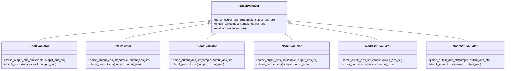
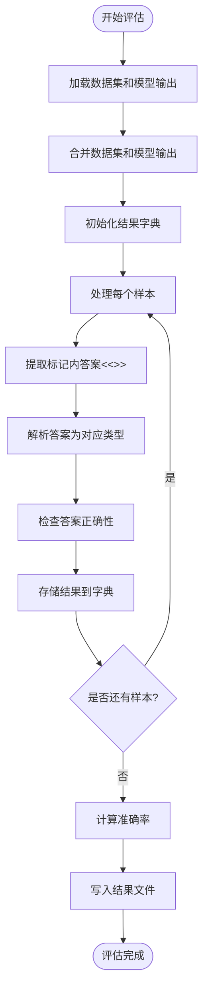
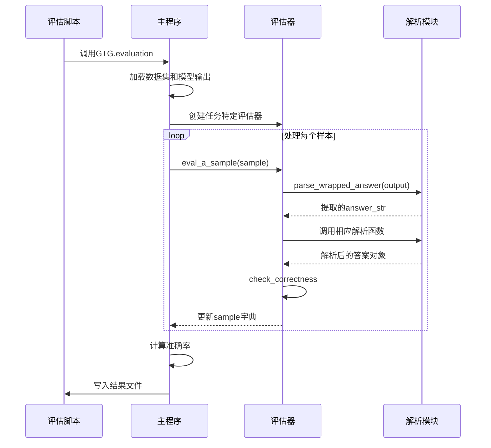

# 评估脚本

<cite>
**本文档中引用的文件**
- [BFS-eval.sh](file://script/evaluation/BFS-eval.sh)
- [DFS-eval.sh](file://script/evaluation/DFS-eval.sh)
- [MST-eval.sh](file://script/evaluation/MST-eval.sh)
- [bipartite-eval.sh](file://script/evaluation/bipartite-eval.sh)
- [clustering_coefficient-eval.sh](file://script/evaluation/clustering_coefficient-eval.sh)
- [common_neighbor-eval.sh](file://script/evaluation/common_neighbor-eval.sh)
- [connected_component-eval.sh](file://script/evaluation/connected_component-eval.sh)
- [connectivity-eval.sh](file://script/evaluation/connectivity-eval.sh)
- [cycle-eval.sh](file://script/evaluation/cycle-eval.sh)
- [degree-eval.sh](file://script/evaluation/degree-eval.sh)
- [diameter-eval.sh](file://script/evaluation/diameter-eval.sh)
- [edge-eval.sh](file://script/evaluation/edge-eval.sh)
- [euler_path-eval.sh](file://script/evaluation/euler_path-eval.sh)
- [hamiltonian_path-eval.sh](file://script/evaluation/hamiltonian_path-eval.sh)
- [jaccard-eval.sh](file://script/evaluation/jaccard-eval.sh)
- [maximum_flow-eval.sh](file://script/evaluation/maximum_flow-eval.sh)
- [neighbor-eval.sh](file://script/evaluation/neighbor-eval.sh)
- [page_rank-eval.sh](file://script/evaluation/page_rank-eval.sh)
- [predecessor-eval.sh](file://script/evaluation/predecessor-eval.sh)
- [shortest_path-eval.sh](file://script/evaluation/shortest_path-eval.sh)
- [topological_sort-eval.sh](file://script/evaluation/topological_sort-eval.sh)
- [GTG/evaluation.py](file://GTG/evaluation.py)
- [GTG/utils/evaluation.py](file://GTG/utils/evaluation.py)
- [GTG/utils/parse_output.py](file://GTG/utils/parse_output.py)
- [GTG/utils/parse_arguments.py](file://GTG/utils/parse_arguments.py)
- [GTG/tasks/BFS/BFS.py](file://GTG/tasks/BFS/BFS.py)
- [GTG/tasks/degree/degree.py](file://GTG/tasks/degree/degree.py)
- [script/run_all_evaluation.sh](file://script/run_all_evaluation.sh)
</cite>

## 目录
1. [简介](#简介)
2. [评估脚本工作流程](#评估脚本工作流程)
3. [输入文件格式要求](#输入文件格式要求)
4. [关键参数说明](#关键参数说明)
5. [评估器类型与任务映射](#评估器类型与任务映射)
6. [运行示例](#运行示例)
7. [输出指标解读](#输出指标解读)
8. [与解析模块的协同工作](#与解析模块的协同工作)
9. [常见评估失败原因及解决方案](#常见评估失败原因及解决方案)
10. [批量评估执行](#批量评估执行)

## 简介
本项目中的评估脚本位于`script/evaluation/`目录下，用于验证大语言模型在各类图论任务上的输出准确性。每个脚本（如BFS-eval.sh）对应一个特定的图论任务，通过调用主评估程序GTG/evaluation.py，利用GTG/utils/evaluation.py中的评估器对模型预测结果与标准答案进行比对，最终生成准确率等评估指标。

## 评估脚本工作流程
评估脚本的工作流程遵循统一的模式：接收模型预测结果文件路径，调用主评估程序，执行评估并生成结果文件。以BFS-eval.sh为例，其工作流程如下：

1. 接收两个命令行参数：数据根目录`data_root`和输出根目录`output_root`
2. 根据任务名称构建输入文件路径：
   - `file_dataset`: 数据集文件路径，格式为`$data_root/$task_name-int_id.csv`
   - `file_answer`: 模型输出文件路径，格式为`$output_root/$task_name-output.csv`
   - `file_result`: 评估结果文件路径，格式为`$output_root/$task_name-results.csv`
3. 调用Python主程序`GTG.evaluation`，传入任务名称和文件路径参数
4. 主程序加载数据集和模型输出，合并后逐样本进行评估
5. 评估器根据任务类型解析模型输出并判断正确性
6. 生成包含准确率和详细结果的CSV文件

**Section sources**
- [BFS-eval.sh](file://script/evaluation/BFS-eval.sh#L1-L14)
- [GTG/evaluation.py](file://GTG/evaluation.py#L1-L73)

## 输入文件格式要求
评估系统依赖于特定格式的输入文件，主要包括数据集文件和模型输出文件。

**数据集文件**（如`BFS-int_id.csv`）包含图结构、问题描述和标准答案，其字段包括：
- `task`: 任务名称
- `graph`: 图的边列表字符串表示，格式为`[(<0>, <1>), (<0>, <2>), ...]`
- `graph_adj`: 图的邻接表字符串表示
- `graph_nl`: 图的自然语言描述
- `nodes`: 节点列表
- `num_nodes`: 节点数量
- `num_edges`: 边数量
- `directed`: 是否为有向图
- `question`: 问题描述
- `answer`: 标准答案
- `steps`: 推理步骤（可选）
- `choices`: 选择题选项（可选）
- `label`: 正确选项标签（可选）

**模型输出文件**（如`BFS-output.csv`）包含模型对每个问题的预测结果，其字段包括：
- `id`: 样本ID
- `output`: 模型的完整输出文本

模型输出必须包含用`<<<`和`>>>`标记包围的最终答案，评估系统会提取此标记内的内容进行解析和比对。

**Section sources**
- [GTG/evaluation.py](file://GTG/evaluation.py#L38-L40)
- [GTG/utils/utils.py](file://GTG/utils/utils.py#L14-L35)
- [GTG/utils/parse_output.py](file://GTG/utils/parse_output.py#L8-L24)

## 关键参数说明
评估脚本和主程序支持多个关键参数，用于控制评估过程。

**评估脚本参数**：
- `data_root`: 数据集根目录路径
- `output_root`: 模型输出和评估结果的根目录路径

**主程序参数**（通过`GTG/utils/parse_arguments.py`解析）：
- `--task`: 任务名称（必需），如`BFS`、`DFS`、`degree`等
- `--file_dataset`: 数据集文件路径（必需）
- `--file_answer`: 模型输出文件路径（必需）
- `--file_result`: 评估结果文件路径（必需）
- `--id_type`: 节点ID类型（可选），默认为`int_id`
- `--file_input`: 输入文件路径（可选）
- `--file_output`: 输出文件路径（可选）
- `--seed`: 随机种子（可选）
- `--hash_str`: 哈希字符串（可选）
- `--num_nodes_range`: 节点数量范围（可选）
- `--link_prob`: 连接概率（可选）
- `--num_samples`: 样本数量（可选）

这些参数通过`parse_arguments()`函数解析，只有非None的参数才会被包含在配置字典中。

**Section sources**
- [BFS-eval.sh](file://script/evaluation/BFS-eval.sh#L1-L8)
- [GTG/evaluation.py](file://GTG/evaluation.py#L11-L12)
- [GTG/utils/parse_arguments.py](file://GTG/utils/parse_arguments.py#L4-L28)

## 评估器类型与任务映射
系统根据任务类型使用不同的评估器，这些评估器继承自`BaseEvaluator`类，实现了特定的解析和比对逻辑。

**主要评估器类型**：
- `BoolEvaluator`: 用于布尔值答案的任务（如`connectivity`、`cycle`、`edge`）
- `IntEvaluator`: 用于整数答案的任务（如`degree`、`diameter`、`maximum_flow`）
- `FloatEvaluator`: 用于浮点数答案的任务（如`jaccard`、`clustering_coefficient`）
- `NodeListEvaluator`: 用于节点序列答案的任务（如`BFS`、`DFS`、`shortest_path`）
- `NodeSetEvaluator`: 用于节点集合答案的任务（如`connected_component`）
- `NodeEvaluator`: 用于单个节点答案的任务（如`predecessor`、`neighbor`）

每个任务在`GTG/evaluation.py`中通过字典映射到对应的评估器类。例如，`BFS`任务映射到`GTG.tasks.BFS.Evaluator`，该类继承自`NodeListEvaluator`并实现了BFS遍历序列的正确性检查。



**Diagram sources**
- [GTG/utils/evaluation.py](file://GTG/utils/evaluation.py#L9-L141)

**Section sources**
- [GTG/evaluation.py](file://GTG/evaluation.py#L14-L36)
- [GTG/utils/evaluation.py](file://GTG/utils/evaluation.py#L56-L141)

## 运行示例
以下是如何运行BFS评估脚本的示例：

```bash
# 设置数据根目录和输出根目录
data_root="./data/dataset"
output_root="./output"

# 运行BFS评估脚本
bash script/evaluation/BFS-eval.sh $data_root $output_root
```

该命令会：
1. 从`$data_root/BFS-int_id.csv`读取数据集
2. 从`$output_root/BFS-output.csv`读取模型输出
3. 调用`GTG.evaluation`主程序进行评估
4. 将评估结果写入`$output_root/BFS-results.csv`

对于其他任务，只需将脚本名称中的`BFS`替换为相应的任务名称即可。例如，评估`degree`任务：
```bash
bash script/evaluation/degree-eval.sh $data_root $output_root
```

**Section sources**
- [BFS-eval.sh](file://script/evaluation/BFS-eval.sh#L1-L14)
- [script/run_all_evaluation.sh](file://script/run_all_evaluation.sh#L1-L32)

## 输出指标解读
评估脚本执行完成后，会生成一个包含详细评估结果的CSV文件。该文件的首行包含准确率信息，后续行包含每个样本的详细评估结果。

**输出文件结构**：
- 第一行：`# accuracy: X.XXXX`，显示整体准确率
- 后续行：每个样本的详细信息，包括原始数据字段和以下新增字段：
  - `output_ans_str`: 从模型输出中提取的标记内答案字符串
  - `output_ans`: 解析后的答案对象（如整数、浮点数、节点列表等）
  - `correct`: 正确性标记（1表示正确，0表示错误）
  - 任务特定字段（如`BFS`任务的`output_path_len`、`output_vailid_path_len`等）

准确率计算为所有样本中`correct`字段的平均值。例如，如果100个样本中有85个被标记为正确，则准确率为0.8500。



**Diagram sources**
- [GTG/evaluation.py](file://GTG/evaluation.py#L38-L67)

**Section sources**
- [GTG/evaluation.py](file://GTG/evaluation.py#L62-L67)

## 与解析模块的协同工作
评估脚本与`GTG/utils/parse_output.py`模块紧密协同，该模块提供了多种解析函数，用于从模型的自由文本输出中提取结构化答案。

**主要解析函数**：
- `parse_wrapped_answer(s)`: 提取`<<<`和`>>>`标记内的答案字符串
- `parse_bool(s)`: 解析布尔值（yes/no, True/False等）
- `parse_first_integer(s)`: 提取字符串中的第一个整数
- `parse_first_float(s)`: 提取字符串中的第一个浮点数或分数
- `parse_node_list(s, sample)`: 解析节点列表，确保节点ID有效
- `parse_list(s)`: 解析Python列表格式的字符串
- `parse_dict(s)`: 解析Python字典格式的字符串
- `parse_first_node_id(s)`: 提取第一个节点ID（如`<0>`）

评估器的`parse_output_ans_str`方法会调用这些解析函数，将提取的字符串答案转换为适当的Python对象，然后在`check_correctness`方法中与标准答案进行比对。



**Diagram sources**
- [GTG/evaluation.py](file://GTG/evaluation.py#L29-L53)
- [GTG/utils/evaluation.py](file://GTG/utils/evaluation.py#L23-L53)
- [GTG/utils/parse_output.py](file://GTG/utils/parse_output.py#L8-L213)

**Section sources**
- [GTG/utils/parse_output.py](file://GTG/utils/parse_output.py#L8-L213)
- [GTG/utils/evaluation.py](file://GTG/utils/evaluation.py#L23-L53)

## 常见评估失败原因及解决方案
在评估过程中可能会遇到各种失败情况，主要原因是模型输出格式不符合预期。

**常见失败原因**：
1. **无法提取标记内答案**：模型输出中缺少`<<<`和`>>>`标记，导致`parse_wrapped_answer`返回None
2. **答案解析失败**：提取的字符串无法被解析为期望的类型（如非数字字符串无法解析为整数）
3. **节点ID无效**：节点列表中包含数据集中不存在的节点ID
4. **序列顺序错误**：对于有序任务（如BFS、DFS），节点遍历顺序不正确
5. **格式不匹配**：模型输出的格式与解析函数期望的格式不符

**解决方案**：
1. **确保标记完整性**：在模型提示中明确要求使用`<<<`和`>>>`标记包围最终答案
2. **规范化输出格式**：在提示中指定答案的期望格式（如整数、布尔值、节点列表等）
3. **验证节点ID**：确保模型只使用数据集中存在的节点ID
4. **提供示例**：在提示中包含输入输出示例，展示正确的答案格式
5. **后处理**：在评估前对模型输出进行预处理，修复常见的格式问题

对于`BFS`等复杂任务，评估器会进行更严格的检查。例如，BFS评估器不仅检查节点是否正确，还会验证遍历顺序是否符合BFS算法的层次遍历特性。

**Section sources**
- [GTG/utils/parse_output.py](file://GTG/utils/parse_output.py#L8-L213)
- [GTG/utils/evaluation.py](file://GTG/utils/evaluation.py#L23-L53)
- [GTG/tasks/BFS/BFS.py](file://GTG/tasks/BFS/BFS.py#L157-L190)

## 批量评估执行
项目提供了`script/run_all_evaluation.sh`脚本用于批量执行所有评估任务。该脚本通过循环调用各个任务的评估脚本，实现一键式全面评估。

使用方法：
```bash
bash script/run_all_evaluation.sh /path/to/output_root
```

该脚本会依次运行所有任务的评估脚本，将结果输出到指定目录。用户可以根据需要注释掉不需要评估的任务，以节省时间和计算资源。

**Section sources**
- [script/run_all_evaluation.sh](file://script/run_all_evaluation.sh#L1-L32)