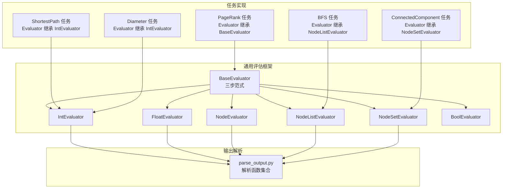
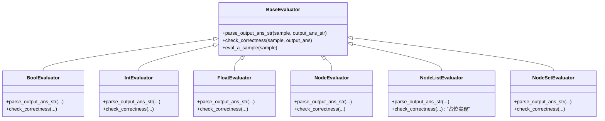
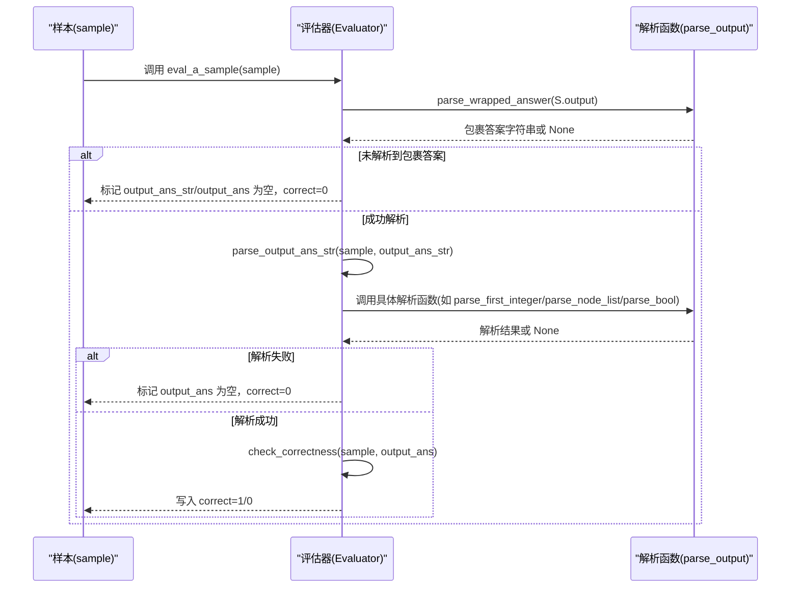
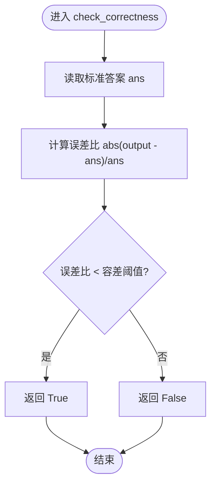
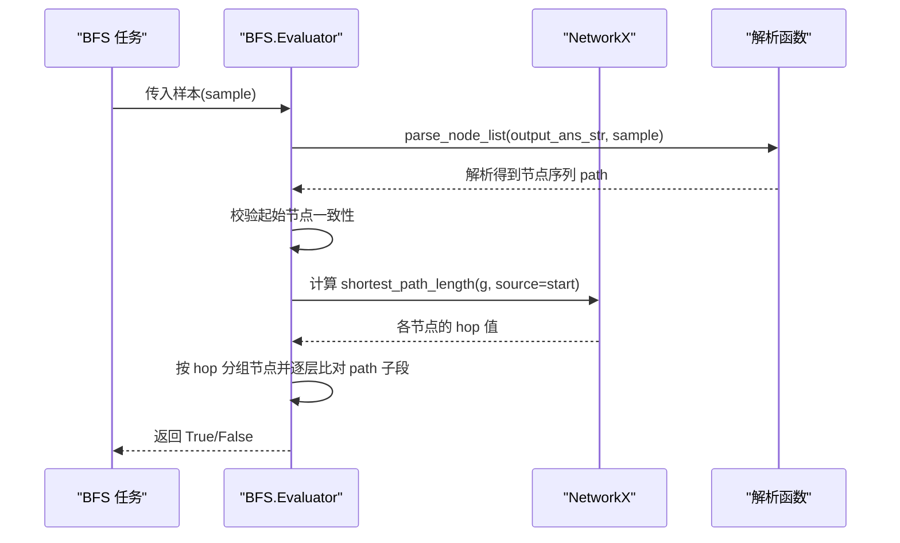
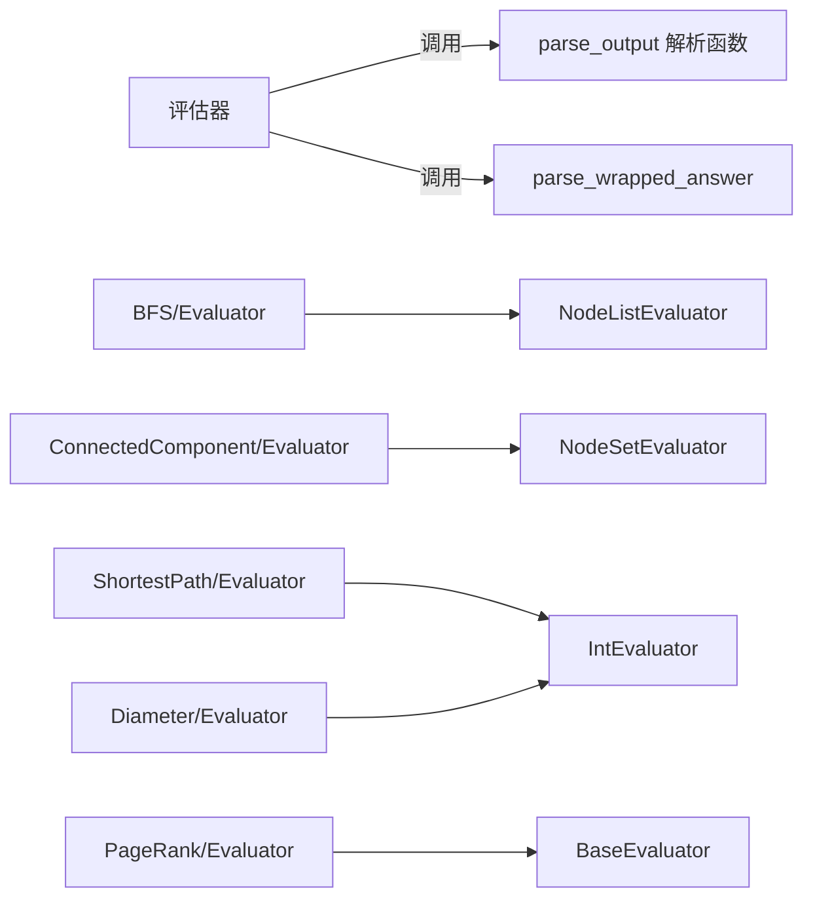

# 正确性检查方法

<cite>
**本文引用的文件**
- [GTG/utils/evaluation.py](file://GTG/utils/evaluation.py)
- [GTG/utils/parse_output.py](file://GTG/utils/parse_output.py)
- [GTG/tasks/BFS/BFS.py](file://GTG/tasks/BFS/BFS.py)
- [GTG/tasks/connected_component/connected_component.py](file://GTG/tasks/connected_component/connected_component.py)
- [GTG/tasks/shortest_path/shortest_path.py](file://GTG/tasks/shortest_path/shortest_path.py)
- [GTG/tasks/diameter/diameter.py](file://GTG/tasks/diameter/diameter.py)
- [GTG/tasks/page_rank/page_rank.py](file://GTG/tasks/page_rank/page_rank.py)
</cite>

## 目录
1. [引言](#引言)
2. [项目结构](#项目结构)
3. [核心组件](#核心组件)
4. [架构总览](#架构总览)
5. [详细组件分析](#详细组件分析)
6. [依赖关系分析](#依赖关系分析)
7. [性能考量](#性能考量)
8. [故障排查指南](#故障排查指南)
9. [结论](#结论)

## 引言
本文件聚焦于评估系统中的“正确性检查”实现机制，系统化梳理了 BaseEvaluator 抽象基类定义的三步评估范式，并深入分析各具体评估器（BoolEvaluator、IntEvaluator、FloatEvaluator、NodeEvaluator、NodeListEvaluator、NodeSetEvaluator）如何针对不同任务类型（布尔判断、整数、浮点数、节点、节点列表、节点集合）实现特定的 parse_output_ans_str 和 check_correctness 方法。同时，以 BFS 与 ConnectedComponent 两类任务为例，说明其评估器如何继承通用评估器并通过定制化的验证逻辑完成正确性判定；解释 FloatEvaluator 中允许相对误差的容错机制；并总结 parse_output 模块中解析函数（如 parse_first_integer、parse_node_list 等）在预处理大模型输出时的关键作用。

## 项目结构
评估相关的核心代码位于 GTG/utils 下的 evaluation.py 与 parse_output.py，以及各任务目录下的任务实现与评估器定义。整体采用“任务生成 + 评估器校验”的分层组织方式：
- 通用评估框架：BaseEvaluator 及其子类
- 输出解析工具：parse_output 提供多种解析函数
- 任务实现与评估器：每个任务在自身目录下定义 Evaluator 类，继承合适的通用评估器并覆盖 check_correctness

图表来源
- [GTG/utils/evaluation.py](file://GTG/utils/evaluation.py#L9-L141)
- [GTG/utils/parse_output.py](file://GTG/utils/parse_output.py#L1-L213)
- [GTG/tasks/BFS/BFS.py](file://GTG/tasks/BFS/BFS.py#L157-L212)
- [GTG/tasks/connected_component/connected_component.py](file://GTG/tasks/connected_component/connected_component.py#L246-L258)
- [GTG/tasks/shortest_path/shortest_path.py](file://GTG/tasks/shortest_path/shortest_path.py#L136-L140)
- [GTG/tasks/diameter/diameter.py](file://GTG/tasks/diameter/diameter.py#L114-L118)
- [GTG/tasks/page_rank/page_rank.py](file://GTG/tasks/page_rank/page_rank.py#L113-L129)

章节来源
- [GTG/utils/evaluation.py](file://GTG/utils/evaluation.py#L9-L141)
- [GTG/utils/parse_output.py](file://GTG/utils/parse_output.py#L1-L213)
- [GTG/tasks/BFS/BFS.py](file://GTG/tasks/BFS/BFS.py#L157-L212)
- [GTG/tasks/connected_component/connected_component.py](file://GTG/tasks/connected_component/connected_component.py#L246-L258)
- [GTG/tasks/shortest_path/shortest_path.py](file://GTG/tasks/shortest_path/shortest_path.py#L136-L140)
- [GTG/tasks/diameter/diameter.py](file://GTG/tasks/diameter/diameter.py#L114-L118)
- [GTG/tasks/page_rank/page_rank.py](file://GTG/tasks/page_rank/page_rank.py#L113-L129)

## 核心组件
- BaseEvaluator：定义三步评估范式
  1) 解包包裹的答案字符串
  2) 解析为具体数据类型
  3) 验证正确性并返回 1/0
- 各类型评估器：
  - BoolEvaluator：解析布尔值并直接与标准答案比较
  - IntEvaluator：解析首个整数并直接比较
  - FloatEvaluator：解析首个浮点数，允许相对误差容错
  - NodeEvaluator：解析单个节点 ID 并与标准答案比较
  - NodeListEvaluator：解析节点序列列表，提供通用 check_correctness 的占位实现
  - NodeSetEvaluator：解析节点集合列表，进行集合相等性比较

章节来源
- [GTG/utils/evaluation.py](file://GTG/utils/evaluation.py#L9-L141)

## 架构总览
下面用类图展示 BaseEvaluator 与其子类的关系，以及与 parse_output 解析函数的耦合点。

图表来源
- [GTG/utils/evaluation.py](file://GTG/utils/evaluation.py#L9-L141)

## 详细组件分析

### BaseEvaluator 三步范式与流程控制
- 解包包裹答案字符串：从样本输出中提取目标答案片段
- 解析为具体数据类型：调用相应评估器的 parse_output_ans_str
- 正确性验证：调用 check_correctness 返回 1 或 0，并写回样本字段

图表来源
- [GTG/utils/evaluation.py](file://GTG/utils/evaluation.py#L23-L54)
- [GTG/utils/parse_output.py](file://GTG/utils/parse_output.py#L8-L25)

章节来源
- [GTG/utils/evaluation.py](file://GTG/utils/evaluation.py#L23-L54)

### 布尔判断：BoolEvaluator
- parse_output_ans_str：调用 parse_bool 将自然语言中的 yes/no 等映射为统一布尔表示
- check_correctness：与标准答案直接比较

章节来源
- [GTG/utils/evaluation.py](file://GTG/utils/evaluation.py#L56-L67)
- [GTG/utils/parse_output.py](file://GTG/utils/parse_output.py#L44-L54)

### 整数：IntEvaluator
- parse_output_ans_str：调用 parse_first_integer 提取首个整数
- check_correctness：与标准答案直接比较
- 典型任务：ShortestPath、Diameter 任务均继承该评估器

章节来源
- [GTG/utils/evaluation.py](file://GTG/utils/evaluation.py#L69-L80)
- [GTG/utils/parse_output.py](file://GTG/utils/parse_output.py#L71-L77)
- [GTG/tasks/shortest_path/shortest_path.py](file://GTG/tasks/shortest_path/shortest_path.py#L136-L140)
- [GTG/tasks/diameter/diameter.py](file://GTG/tasks/diameter/diameter.py#L114-L118)

### 浮点数：FloatEvaluator 与容错机制
- parse_output_ans_str：调用 parse_first_float 提取首个浮点数（支持小数与分数）
- check_correctness：允许相对误差阈值（示例中为 3%），通过绝对差与标准答案的比值判断
- 注意：parse_output 中还存在 eval_float 使用 5% 容差的实现，但 FloatEvaluator 使用 3% 容差

图表来源
- [GTG/utils/evaluation.py](file://GTG/utils/evaluation.py#L82-L95)
- [GTG/utils/parse_output.py](file://GTG/utils/parse_output.py#L79-L90)

章节来源
- [GTG/utils/evaluation.py](file://GTG/utils/evaluation.py#L82-L95)
- [GTG/utils/parse_output.py](file://GTG/utils/parse_output.py#L79-L90)

### 节点与节点列表/集合：NodeEvaluator、NodeListEvaluator、NodeSetEvaluator
- NodeEvaluator：解析单个节点 ID，要求在合法节点集合内
- NodeListEvaluator：解析节点序列列表，提供通用 check_correctness 占位
- NodeSetEvaluator：解析节点集合列表，进行集合相等性比较

章节来源
- [GTG/utils/evaluation.py](file://GTG/utils/evaluation.py#L97-L141)
- [GTG/utils/parse_output.py](file://GTG/utils/parse_output.py#L93-L118)

### 任务示例一：BFS（路径顺序验证）
- 继承：NodeListEvaluator
- 自定义 check_correctness：基于图的最短路层级（hops）对输出序列进行分层比对，确保每层节点集合一致且按层级顺序出现
- 关键点：
  - 要求起始节点一致
  - 逐层比较输出与理论层级节点集合是否相等

图表来源
- [GTG/tasks/BFS/BFS.py](file://GTG/tasks/BFS/BFS.py#L157-L212)
- [GTG/utils/parse_output.py](file://GTG/utils/parse_output.py#L107-L118)

章节来源
- [GTG/tasks/BFS/BFS.py](file://GTG/tasks/BFS/BFS.py#L157-L212)

### 任务示例二：ConnectedComponent（集合比对）
- 继承：NodeSetEvaluator
- 自定义 check_correctness：将标准答案解析为节点集合，与模型输出解析后的集合进行集合相等性比较
- 关键点：输出与标准答案均为节点集合，不考虑顺序

章节来源
- [GTG/tasks/connected_component/connected_component.py](file://GTG/tasks/connected_component/connected_component.py#L246-L258)
- [GTG/utils/evaluation.py](file://GTG/utils/evaluation.py#L128-L141)

### 任务示例三：ShortestPath（路径长度数值）
- 继承：IntEvaluator
- 验证方式：直接比较整数路径长度
- 关键点：parse_first_integer 会先移除节点标识后再解析

章节来源
- [GTG/tasks/shortest_path/shortest_path.py](file://GTG/tasks/shortest_path/shortest_path.py#L136-L140)
- [GTG/utils/evaluation.py](file://GTG/utils/evaluation.py#L69-L80)
- [GTG/utils/parse_output.py](file://GTG/utils/parse_output.py#L65-L69)

### 任务示例四：PageRank（节点选择）
- 继承：BaseEvaluator（自定义 parse_output_ans_str 与 check_correctness）
- 验证方式：解析单个节点 ID，判断是否属于标准答案集合

章节来源
- [GTG/tasks/page_rank/page_rank.py](file://GTG/tasks/page_rank/page_rank.py#L113-L129)
- [GTG/utils/parse_output.py](file://GTG/utils/parse_output.py#L93-L105)

## 依赖关系分析
- 评估器与解析函数的耦合：
  - IntEvaluator/FloatEvaluator/NodeEvaluator/NodeListEvaluator/NodeSetEvaluator 均依赖 parse_output 中的解析函数
  - BaseEvaluator 的 eval_a_sample 依赖 parse_wrapped_answer 进行答案解包
- 任务与评估器的耦合：
  - 各任务在自身目录下定义 Evaluator，继承对应通用评估器并覆盖 check_correctness
  - 例如 BFS 继承 NodeListEvaluator，ConnectedComponent 继承 NodeSetEvaluator，ShortestPath/Diameter 继承 IntEvaluator

图表来源
- [GTG/utils/evaluation.py](file://GTG/utils/evaluation.py#L9-L141)
- [GTG/utils/parse_output.py](file://GTG/utils/parse_output.py#L8-L25)
- [GTG/tasks/BFS/BFS.py](file://GTG/tasks/BFS/BFS.py#L157-L212)
- [GTG/tasks/connected_component/connected_component.py](file://GTG/tasks/connected_component/connected_component.py#L246-L258)
- [GTG/tasks/shortest_path/shortest_path.py](file://GTG/tasks/shortest_path/shortest_path.py#L136-L140)
- [GTG/tasks/diameter/diameter.py](file://GTG/tasks/diameter/diameter.py#L114-L118)
- [GTG/tasks/page_rank/page_rank.py](file://GTG/tasks/page_rank/page_rank.py#L113-L129)

章节来源
- [GTG/utils/evaluation.py](file://GTG/utils/evaluation.py#L9-L141)
- [GTG/utils/parse_output.py](file://GTG/utils/parse_output.py#L1-L213)
- [GTG/tasks/BFS/BFS.py](file://GTG/tasks/BFS/BFS.py#L157-L212)
- [GTG/tasks/connected_component/connected_component.py](file://GTG/tasks/connected_component/connected_component.py#L246-L258)
- [GTG/tasks/shortest_path/shortest_path.py](file://GTG/tasks/shortest_path/shortest_path.py#L136-L140)
- [GTG/tasks/diameter/diameter.py](file://GTG/tasks/diameter/diameter.py#L114-L118)
- [GTG/tasks/page_rank/page_rank.py](file://GTG/tasks/page_rank/page_rank.py#L113-L129)

## 性能考量
- 解析复杂度
  - parse_first_integer/parse_first_float：线性扫描字符串，复杂度 O(n)
  - parse_node_list：去标点、分割、可选合法性检查，复杂度 O(n)
  - parse_wrapped_answer：线性扫描左右标记，复杂度 O(n)
- 验证复杂度
  - 整数/布尔：O(1)
  - 浮点：O(1)，含一次除法与比较
  - 集合比对：O(m)，m 为节点数量
  - BFS 层级比对：O(n)，n 为节点总数
- I/O 与外部库
  - NetworkX 的 shortest_path_length 在稀疏图上通常较快，但在大规模图上仍需注意时间开销
- 建议
  - 对大规模图任务，尽量减少重复计算（如复用 shortest_path_length 结果）
  - 对浮点比较，保持统一的容差策略，避免在不同评估器间产生歧义

## 故障排查指南
- 无法解析包裹答案
  - 现象：eval_a_sample 直接将 correct 设为 0
  - 排查：确认输出格式是否包含包裹标记；检查 parse_wrapped_answer 的左右标记是否匹配
- 解析为 None
  - 现象：parse_output_ans_str 返回 None，correct 设为 0
  - 排查：检查输入文本是否包含目标数字/节点/布尔词；对于整数/浮点，确认去除节点标识后仍可被识别
- 集合/列表不一致
  - 现象：NodeSetEvaluator/NodeListEvaluator 的 check_correctness 返回 False
  - 排查：确认节点 ID 的表示是否一致（如带尖括号与否）；集合比较忽略顺序，列表比较严格
- BFS 验证失败
  - 现象：起始节点不一致或某层节点集合不匹配
  - 排查：核对问题描述中的起始节点；确认输出序列是否严格遵循层次遍历规则
- 浮点容差导致误判
  - 现象：极小值或接近零的标准答案导致相对误差异常放大
  - 排查：确认 FloatEvaluator 的容差阈值是否合理；必要时调整或改用绝对误差

章节来源
- [GTG/utils/evaluation.py](file://GTG/utils/evaluation.py#L23-L54)
- [GTG/utils/parse_output.py](file://GTG/utils/parse_output.py#L65-L118)
- [GTG/tasks/BFS/BFS.py](file://GTG/tasks/BFS/BFS.py#L162-L190)
- [GTG/utils/evaluation.py](file://GTG/utils/evaluation.py#L82-L95)

## 结论
评估系统的正确性检查围绕 BaseEvaluator 的三步范式展开：解包、解析、验证。通过将解析逻辑集中在 parse_output 模块，评估器专注于任务语义的验证，实现了高内聚低耦合的设计。不同任务通过继承合适的通用评估器并覆盖 check_correctness，即可快速适配各自的验证需求。BFS 与 ConnectedComponent 的实现分别展示了“序列层级比对”和“集合相等性”的典型验证思路；FloatEvaluator 的相对误差容差机制则体现了对数值稳定性与鲁棒性的重视。整体架构清晰、扩展性强，便于后续新增任务与评估器。