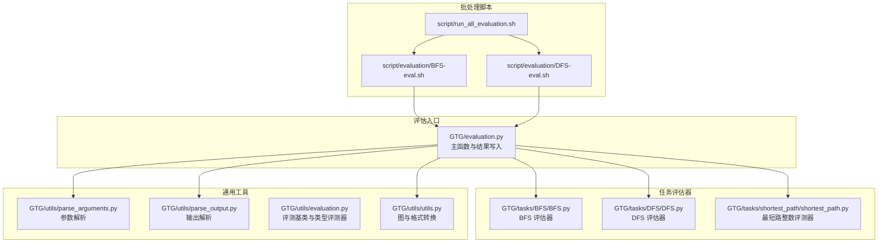
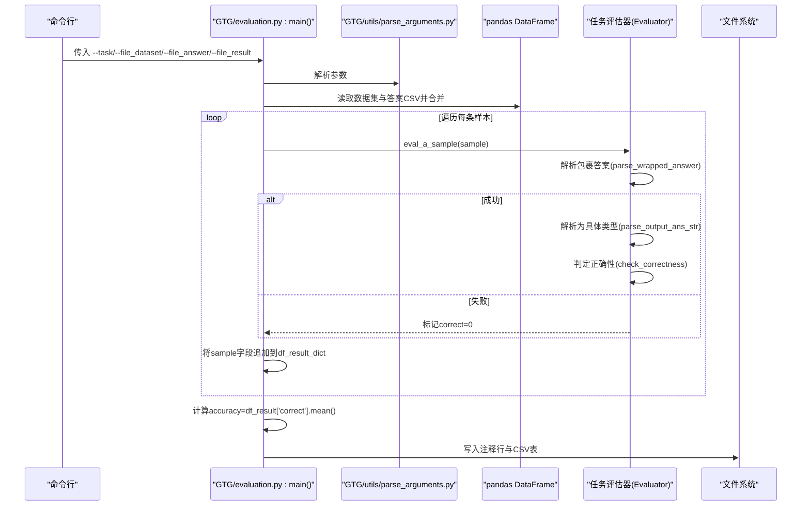
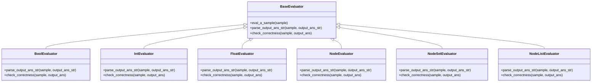
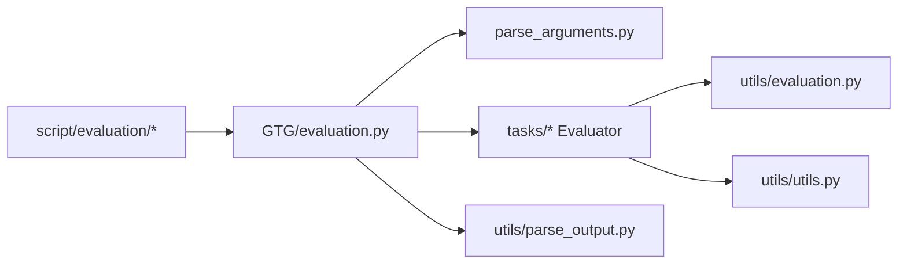

# 结果分析

<cite>
**本文引用的文件**
- [GTG/evaluation.py](file://GTG/evaluation.py)
- [GTG/utils/evaluation.py](file://GTG/utils/evaluation.py)
- [GTG/utils/parse_output.py](file://GTG/utils/parse_output.py)
- [GTG/utils/utils.py](file://GTG/utils/utils.py)
- [GTG/tasks/BFS/BFS.py](file://GTG/tasks/BFS/BFS.py)
- [GTG/tasks/DFS/DFS.py](file://GTG/tasks/DFS/DFS.py)
- [GTG/tasks/shortest_path/shortest_path.py](file://GTG/tasks/shortest_path/shortest_path.py)
- [GTG/utils/parse_arguments.py](file://GTG/utils/parse_arguments.py)
- [script/evaluation/BFS-eval.sh](file://script/evaluation/BFS-eval.sh)
- [script/evaluation/DFS-eval.sh](file://script/evaluation/DFS-eval.sh)
- [script/run_all_evaluation.sh](file://script/run_all_evaluation.sh)
</cite>

## 目录
1. [引言](#引言)
2. [项目结构](#项目结构)
3. [核心组件](#核心组件)
4. [架构总览](#架构总览)
5. [详细组件分析](#详细组件分析)
6. [依赖关系分析](#依赖关系分析)
7. [性能考量](#性能考量)
8. [故障排查指南](#故障排查指南)
9. [结论](#结论)
10. [附录](#附录)

## 引言
本文件系统化说明评估流程中“结果生成、格式与分析”的完整链路，重点围绕以下目标展开：
- df_result_dict 字典的构建过程与字段含义
- 原始数据、模型输出、解析后的答案（output_ans_str、output_ans）与正确性标记（correct）的整合方式
- 特定任务（如 DFS）如何扩展评估维度（如 output_path_len、output_vailid_path_len、output_vailid_path）
- 准确率（accuracy）作为核心指标的计算方式（correct 列的均值）
- 最终输出文件 file_result 的结构规范：首行为注释记录总体准确率，其后为完整 CSV 表格
- 报告解读指南：如何基于 correct 列筛选错误样本进行错误分析；如何利用额外字段诊断模型在特定方面的缺陷（如路径长度正确但节点顺序错误）
- 结合 BFS-eval.sh 等脚本批量运行评估并收集结果的方法

## 项目结构
评估主流程位于 GTG/evaluation.py，具体任务的评估器位于 GTG/tasks/*，通用解析与评测工具位于 GTG/utils/*。脚本位于 script/evaluation/*，用于批量执行评估。

图表来源
- [GTG/evaluation.py](file://GTG/evaluation.py#L1-L73)
- [GTG/tasks/BFS/BFS.py](file://GTG/tasks/BFS/BFS.py#L1-L212)
- [GTG/tasks/DFS/DFS.py](file://GTG/tasks/DFS/DFS.py#L1-L333)
- [GTG/tasks/shortest_path/shortest_path.py](file://GTG/tasks/shortest_path/shortest_path.py#L1-L140)
- [GTG/utils/parse_arguments.py](file://GTG/utils/parse_arguments.py#L1-L28)
- [GTG/utils/parse_output.py](file://GTG/utils/parse_output.py#L1-L213)
- [GTG/utils/evaluation.py](file://GTG/utils/evaluation.py#L1-L283)
- [GTG/utils/utils.py](file://GTG/utils/utils.py#L1-L200)
- [script/evaluation/BFS-eval.sh](file://script/evaluation/BFS-eval.sh#L1-L14)
- [script/evaluation/DFS-eval.sh](file://script/evaluation/DFS-eval.sh#L1-L14)
- [script/run_all_evaluation.sh](file://script/run_all_evaluation.sh#L1-L32)

章节来源
- [GTG/evaluation.py](file://GTG/evaluation.py#L1-L73)
- [script/evaluation/BFS-eval.sh](file://script/evaluation/BFS-eval.sh#L1-L14)
- [script/evaluation/DFS-eval.sh](file://script/evaluation/DFS-eval.sh#L1-L14)
- [script/run_all_evaluation.sh](file://script/run_all_evaluation.sh#L1-L32)

## 核心组件
- 评估主流程（GTG/evaluation.py）：读取数据集与模型输出，构造 df_result_dict，逐样本调用对应任务评估器，汇总正确性与解析结果，并输出带注释的 CSV 文件。
- 评测基类与类型评测器（GTG/utils/evaluation.py）：定义统一的解析与正确性判定流程，提供布尔、整数、浮点、节点列表/集合等评测器。
- 输出解析工具（GTG/utils/parse_output.py）：负责从模型输出中提取包裹的答案片段、解析布尔/整数/浮点、节点列表等。
- 任务评估器（GTG/tasks/*/）：针对不同任务实现 check_correctness，DFS/BFS 还会补充路径有效性相关字段。
- 图与格式转换（GTG/utils/utils.py）：提供图字符串与对象互转、节点 ID 格式化等工具，供任务评估器使用。
- 参数解析（GTG/utils/parse_arguments.py）：将命令行参数映射为配置字典。
- 批处理脚本（script/evaluation/*）：封装数据集、答案与结果文件路径，调用评估主流程。

章节来源
- [GTG/evaluation.py](file://GTG/evaluation.py#L1-L73)
- [GTG/utils/evaluation.py](file://GTG/utils/evaluation.py#L1-L283)
- [GTG/utils/parse_output.py](file://GTG/utils/parse_output.py#L1-L213)
- [GTG/utils/utils.py](file://GTG/utils/utils.py#L1-L200)
- [GTG/utils/parse_arguments.py](file://GTG/utils/parse_arguments.py#L1-L28)
- [GTG/tasks/BFS/BFS.py](file://GTG/tasks/BFS/BFS.py#L1-L212)
- [GTG/tasks/DFS/DFS.py](file://GTG/tasks/DFS/DFS.py#L1-L333)
- [GTG/tasks/shortest_path/shortest_path.py](file://GTG/tasks/shortest_path/shortest_path.py#L1-L140)

## 架构总览
下图展示了评估主流程的关键调用序列：从参数解析到数据合并、逐样本评测、结果汇总与写入。

图表来源
- [GTG/evaluation.py](file://GTG/evaluation.py#L1-L73)
- [GTG/utils/parse_arguments.py](file://GTG/utils/parse_arguments.py#L1-L28)
- [GTG/utils/evaluation.py](file://GTG/utils/evaluation.py#L1-L283)
- [GTG/utils/parse_output.py](file://GTG/utils/parse_output.py#L1-L213)

## 详细组件分析

### df_result_dict 的构建与字段语义
- 数据来源与合并
  - 读取数据集 CSV 与答案 CSV，按 id 进行合并，形成包含问题、图、答案、模型输出等字段的 DataFrame。
- 字典初始化
  - 以合并后的 DataFrame 的列名作为键，初始化空列表；同时追加 output_ans_str、output_ans、correct 三列，用于存储解析与正确性判定结果。
- 任务特有字段
  - 当任务为 DFS 时，额外追加 output_path_len、output_vailid_path_len、output_vailid_path，用于记录路径长度与前缀有效部分，便于细粒度诊断。
- 逐样本填充
  - 对每条样本调用对应任务评估器的 eval_a_sample，评估器内部完成解析与正确性判定，并将新字段写回 sample；主流程再将 sample 中的每个键对应的值追加到 df_result_dict 对应的列表中。
- 结果 DataFrame 与准确率
  - 将 df_result_dict 转换为 DataFrame，计算 accuracy = df_result['correct'].mean()，并在最终 CSV 文件首行以注释形式输出。

章节来源
- [GTG/evaluation.py](file://GTG/evaluation.py#L1-L73)

### 评测基类与类型评测器
- BaseEvaluator.eval_a_sample
  - 统一流程：先解析包裹答案，若成功则进一步解析为具体类型，再调用 check_correctness 判定正确性；失败则将 correct 标记为 0。
- BoolEvaluator/IntEvaluator/FloatEvaluator/NodeEvaluator/NodeSetEvaluator
  - 分别针对布尔、整数、浮点、单节点、节点集合等类型，提供 parse_* 与 check_correctness 实现。
- NodeListEvaluator
  - 用于节点序列类任务（如 BFS/DFS），check_correctness 由各任务自定义实现。

图表来源
- [GTG/utils/evaluation.py](file://GTG/utils/evaluation.py#L1-L283)

章节来源
- [GTG/utils/evaluation.py](file://GTG/utils/evaluation.py#L1-L283)

### 输出解析与类型解析
- 包裹答案提取
  - 从模型输出中查找特定标记范围内的文本，作为包裹答案。
- 类型解析
  - 布尔：识别 yes/no 等关键词。
  - 整数/浮点：提取首个数字或分数表达式。
  - 节点列表：去除标点与括号后拆分，校验节点 ID 是否在合法集合内。
- 工具函数
  - remove_all_node_id：移除输出中的节点 ID 标记，便于数值解析。
  - get_nodes_set/get_nodes_set_from_nodes_str：从样本中提取合法节点集合。

章节来源
- [GTG/utils/parse_output.py](file://GTG/utils/parse_output.py#L1-L213)

### BFS 评估器
- 评测逻辑
  - 从问题字符串中提取起始节点，检查路径非空且首节点一致。
  - 使用网络库计算从起点出发的最短步数，按层（hops）分组比对路径中对应层节点集合是否一致，从而判断 BFS 序列是否符合层次遍历规则。
- 附加字段
  - output_path_len：路径长度
  - output_vailid_path_len：前缀有效长度（首个不满足条件位置）
  - output_vailid_path：前缀有效部分

章节来源
- [GTG/tasks/BFS/BFS.py](file://GTG/tasks/BFS/BFS.py#L1-L212)

### DFS 评估器
- 评测逻辑
  - 从问题字符串中提取起始节点，检查路径非空且首节点一致。
  - 采用子路径扫描与回溯策略，验证相邻节点间是否存在边、是否重复访问未访问节点、以及是否存在“回退”时仍有可用邻居等约束，从而判断 DFS 序列是否符合深度优先规则。
- 附加字段
  - output_path_len：路径长度
  - output_vailid_path_len：前缀有效长度（首个不满足条件位置）
  - output_vailid_path：前缀有效部分

章节来源
- [GTG/tasks/DFS/DFS.py](file://GTG/tasks/DFS/DFS.py#L1-L333)

### 其他任务（以最短路为例）
- 评测器继承 IntEvaluator，直接比较解析出的整数与标准答案。
- 适用于数值类任务，准确率计算方式同上。

章节来源
- [GTG/tasks/shortest_path/shortest_path.py](file://GTG/tasks/shortest_path/shortest_path.py#L1-L140)
- [GTG/utils/evaluation.py](file://GTG/utils/evaluation.py#L1-L283)

### 批量评估与结果收集
- 单任务脚本
  - BFS-eval.sh/DFS-eval.sh：设置任务名、数据集、答案与结果文件路径，调用 Python 模块 GTG.evaluation。
- 全量运行
  - run_all_evaluation.sh：可启用多个任务的评估脚本，统一收集结果。

章节来源
- [script/evaluation/BFS-eval.sh](file://script/evaluation/BFS-eval.sh#L1-L14)
- [script/evaluation/DFS-eval.sh](file://script/evaluation/DFS-eval.sh#L1-L14)
- [script/run_all_evaluation.sh](file://script/run_all_evaluation.sh#L1-L32)

## 依赖关系分析
- 主流程依赖
  - 任务评估器：根据 --task 参数选择对应 Evaluator 实例。
  - 评测基类与类型评测器：提供统一解析与正确性判定框架。
  - 输出解析工具：负责从模型输出中提取包裹答案与具体类型。
  - 图工具：将字符串图表示转换为网络库对象，供路径合法性检查使用。
- 批处理脚本依赖
  - 通过固定路径约定连接数据集、答案与结果文件，确保评估主流程输入输出一致。

图表来源
- [GTG/evaluation.py](file://GTG/evaluation.py#L1-L73)
- [GTG/utils/parse_arguments.py](file://GTG/utils/parse_arguments.py#L1-L28)
- [GTG/utils/evaluation.py](file://GTG/utils/evaluation.py#L1-L283)
- [GTG/utils/parse_output.py](file://GTG/utils/parse_output.py#L1-L213)
- [GTG/utils/utils.py](file://GTG/utils/utils.py#L1-L200)
- [script/evaluation/BFS-eval.sh](file://script/evaluation/BFS-eval.sh#L1-L14)
- [script/evaluation/DFS-eval.sh](file://script/evaluation/DFS-eval.sh#L1-L14)

## 性能考量
- 评测复杂度
  - BFS/DFS 评估涉及图遍历与集合对比，整体复杂度与路径长度线性相关；对于大规模图，建议控制路径长度上限与样本规模。
- I/O 与内存
  - 合并数据集与答案 CSV、逐样本写入 df_result_dict 可能占用较多内存，建议在样本量较大时分批处理或优化数据类型。
- 并发与加速
  - 当前主流程为串行迭代，若需加速可在保证正确性的前提下引入多进程/线程池（需谨慎处理共享状态与文件写入竞争）。

## 故障排查指南
- 包裹答案为空
  - 现象：correct=0，output_ans_str=None。原因可能是模型输出未包含包裹标记或格式不符。
  - 排查：确认模型输出格式与包裹标记一致；检查 parse_wrapped_answer 的边界匹配逻辑。
- 类型解析失败
  - 现象：correct=0，output_ans=None。原因可能是数值/节点列表格式不符合预期。
  - 排查：核对 parse_first_integer/parse_first_float/parse_node_list 的正则与清洗逻辑；必要时使用 remove_all_node_id 去除干扰。
- 路径合法性问题（BFS/DFS）
  - 现象：correct=0，附加字段显示前缀有效长度小于总长度。
  - 排查：对照 output_vailid_path_len 与 output_vailid_path 定位第一个违规位置；检查边存在性、访问顺序与层次约束。
- 文件路径与命名
  - 现象：脚本无法找到数据/答案/结果文件。
  - 排查：确认脚本中 data_root/output_root 设置正确；确保 CSV 文件命名与任务名一致。

章节来源
- [GTG/utils/parse_output.py](file://GTG/utils/parse_output.py#L1-L213)
- [GTG/tasks/BFS/BFS.py](file://GTG/tasks/BFS/BFS.py#L1-L212)
- [GTG/tasks/DFS/DFS.py](file://GTG/tasks/DFS/DFS.py#L1-L333)
- [script/evaluation/BFS-eval.sh](file://script/evaluation/BFS-eval.sh#L1-L14)
- [script/evaluation/DFS-eval.sh](file://script/evaluation/DFS-eval.sh#L1-L14)

## 结论
本评估体系通过统一的评测基类与解析工具，将模型输出标准化为可比较的结构化答案，并以任务特定的判据进行正确性判定。DFS/BFS 评估器在基础正确性之外，还提供了路径有效性诊断字段，便于深入定位模型缺陷。最终输出文件以注释行记录总体准确率，并以完整 CSV 表格呈现所有样本的详细信息，支持后续统计与错误分析。

## 附录

### 准确率计算与文件结构
- 准确率（accuracy）
  - 定义：correct 列的均值，即正确样本数占总样本数的比例。
- 输出文件（file_result）
  - 首行：以注释形式记录总体准确率。
  - 后续行：完整 CSV 表格，包含原始字段、解析后字段与正确性标记，以及任务特定的诊断字段（如 DFS 的路径长度与前缀有效部分）。

章节来源
- [GTG/evaluation.py](file://GTG/evaluation.py#L1-L73)

### 报告解读与错误分析指引
- 筛选错误样本
  - 依据 correct=0 过滤，查看 output_ans_str 与 output_ans，定位解析失败或类型不符的样本。
- 诊断路径类任务
  - DFS：关注 output_path_len 与 output_vailid_path_len，若前者较大而后者较小，说明路径较长但前缀有效；结合 output_vailid_path 观察第一个违规位置，判断是起始节点不一致、边不存在还是访问顺序错误。
  - BFS：关注层次一致性，若某一层节点集合不匹配，说明节点被提前或延后访问，违反层次遍历规则。
- 数值类任务
  - 查看解析出的数值与标准答案的差异，结合 FloatEvaluator 的误差比例阈值进行判断。

章节来源
- [GTG/tasks/DFS/DFS.py](file://GTG/tasks/DFS/DFS.py#L1-L333)
- [GTG/tasks/BFS/BFS.py](file://GTG/tasks/BFS/BFS.py#L1-L212)
- [GTG/utils/evaluation.py](file://GTG/utils/evaluation.py#L1-L283)

### 批量运行与结果收集
- 单任务运行
  - 使用 BFS-eval.sh/DFS-eval.sh 指定数据根目录与输出根目录，自动拼接文件路径并调用评估主流程。
- 全量运行
  - 在 run_all_evaluation.sh 中启用多个任务脚本，统一收集各任务的结果文件，便于横向对比与汇总。

章节来源
- [script/evaluation/BFS-eval.sh](file://script/evaluation/BFS-eval.sh#L1-L14)
- [script/evaluation/DFS-eval.sh](file://script/evaluation/DFS-eval.sh#L1-L14)
- [script/run_all_evaluation.sh](file://script/run_all_evaluation.sh#L1-L32)