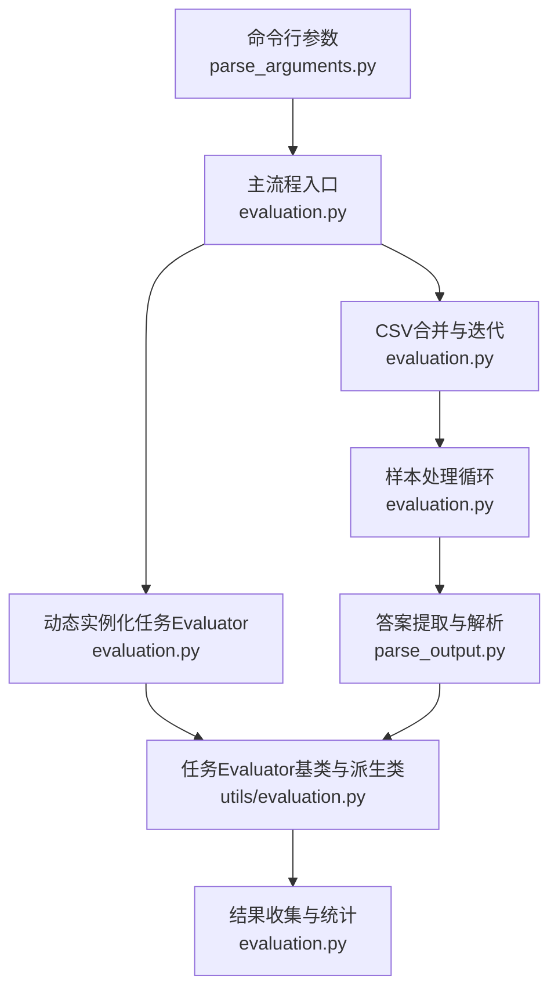
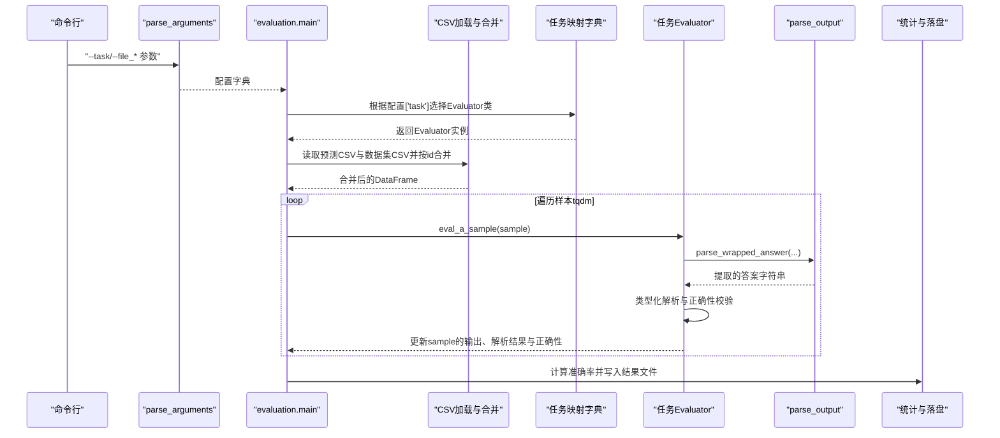
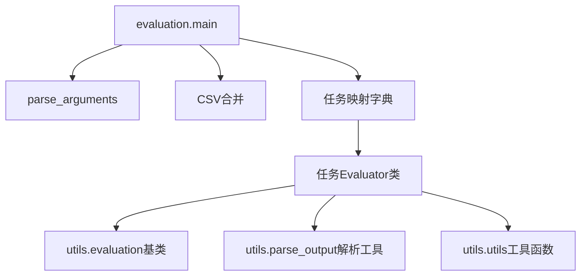

# 评估流程

<cite>
**本文引用的文件**
- [GTG/evaluation.py](file://GTG/evaluation.py)
- [GTG/utils/evaluation.py](file://GTG/utils/evaluation.py)
- [GTG/utils/parse_arguments.py](file://GTG/utils/parse_arguments.py)
- [GTG/utils/parse_output.py](file://GTG/utils/parse_output.py)
- [GTG/utils/utils.py](file://GTG/utils/utils.py)
- [GTG/tasks/topological_sort/topological_sort.py](file://GTG/tasks/topological_sort/topological_sort.py)
- [GTG/tasks/shortest_path/shortest_path.py](file://GTG/tasks/shortest_path/shortest_path.py)
- [GTG/tasks/bipartite/bipartite.py](file://GTG/tasks/bipartite/bipartite.py)
</cite>

## 目录
1. [引言](#引言)
2. [项目结构](#项目结构)
3. [核心组件](#核心组件)
4. [架构总览](#架构总览)
5. [详细组件分析](#详细组件分析)
6. [依赖关系分析](#依赖关系分析)
7. [性能考量](#性能考量)
8. [故障排查指南](#故障排查指南)
9. [结论](#结论)

## 引言
本文件面向“评估系统”的整体执行流程，围绕调用入口 evaluation.py 的 main 函数展开，系统性说明以下关键环节：
- 命令行参数解析：parse_arguments 如何将 CLI 参数转换为配置字典
- 数据加载与合并：读取 CSV 格式的预测结果与原始数据集并按 id 合并
- 动态实例化：依据配置中的任务名，从 GTG/tasks/ 下动态选择对应任务的 Evaluator 类
- 样本遍历与评估：使用 tqdm 包裹的迭代器逐样本调用 eval_a_sample，并记录输出、解析结果与正确性
- 答案提取与解析：对原始输出字符串使用 parse_wrapped_answer 提取目标片段，再交由具体解析器完成类型化解析与校验
- 结果汇总与报告：构造结果数据框、计算准确率并写入最终评估报告

## 项目结构
评估相关代码主要分布在 GTG/evaluation.py、GTG/utils/evaluation.py、GTG/utils/parse_arguments.py、GTG/utils/parse_output.py、GTG/utils/utils.py，以及各任务的 Evaluator 实现（位于 GTG/tasks/<task>/）。下图给出与评估流程直接相关的模块与文件关系。

图表来源
- [GTG/evaluation.py](file://GTG/evaluation.py#L1-L73)
- [GTG/utils/parse_arguments.py](file://GTG/utils/parse_arguments.py#L1-L28)
- [GTG/utils/evaluation.py](file://GTG/utils/evaluation.py#L1-L283)
- [GTG/utils/parse_output.py](file://GTG/utils/parse_output.py#L1-L213)

章节来源
- [GTG/evaluation.py](file://GTG/evaluation.py#L1-L73)
- [GTG/utils/parse_arguments.py](file://GTG/utils/parse_arguments.py#L1-L28)
- [GTG/utils/evaluation.py](file://GTG/utils/evaluation.py#L1-L283)
- [GTG/utils/parse_output.py](file://GTG/utils/parse_output.py#L1-L213)

## 核心组件
- 命令行参数解析器：负责解析 --task、--file_dataset、--file_answer、--file_result 等关键参数，生成配置字典供后续流程使用
- 主流程入口：负责加载预测结果与数据集、合并、实例化任务对应的 Evaluator、遍历样本并评估、汇总统计与落盘
- 解析与评估框架：提供 BaseEvaluator 及多种类型化评估器（Bool、Int、Float、Node、NodeList、NodeSet），统一处理“提取答案片段→类型化解析→正确性校验”的三段式流程
- 输出解析工具：提供 parse_wrapped_answer 等函数，从大模型输出中抽取被标记的候选答案片段，并进一步做布尔、整数、浮点、节点列表等解析

章节来源
- [GTG/evaluation.py](file://GTG/evaluation.py#L1-L73)
- [GTG/utils/evaluation.py](file://GTG/utils/evaluation.py#L1-L283)
- [GTG/utils/parse_output.py](file://GTG/utils/parse_output.py#L1-L213)

## 架构总览
下图展示从 main 入口到任务评估器的调用链路与数据流。

图表来源
- [GTG/evaluation.py](file://GTG/evaluation.py#L1-L73)
- [GTG/utils/parse_arguments.py](file://GTG/utils/parse_arguments.py#L1-L28)
- [GTG/utils/parse_output.py](file://GTG/utils/parse_output.py#L1-L213)
- [GTG/utils/evaluation.py](file://GTG/utils/evaluation.py#L1-L283)

## 详细组件分析

### 命令行参数解析：parse_arguments
- 负责定义并解析 --task、--file_dataset、--file_answer、--file_result 等参数
- 将解析结果转换为字典，过滤掉 None 值或特殊字符串（如 'none'/'None'），便于后续流程直接使用

章节来源
- [GTG/utils/parse_arguments.py](file://GTG/utils/parse_arguments.py#L1-L28)

### 主流程入口：evaluation.main
- 加载配置后打印配置摘要
- 依据配置中的任务名，从预置映射字典中选择对应任务的 Evaluator 类并实例化
- 读取预测结果 CSV 与原始数据集 CSV，并以 id 字段进行合并
- 初始化结果字典，用于收集每列的值及新增列（如 output_ans_str、output_ans、correct 等）
- 使用 tqdm 包裹 DataFrame 的迭代器，逐样本调用 Evaluator.eval_a_sample(sample)
- 将样本更新后的字段追加到结果字典，最终构造结果 DataFrame
- 计算准确率并写入文件（包含标题与 CSV 内容）

章节来源
- [GTG/evaluation.py](file://GTG/evaluation.py#L1-L73)

### 动态实例化：基于配置的 Evaluator 选择
- 在 evaluation.py 中维护一个任务名到 Evaluator 类的映射字典
- 通过 config['task'] 查找对应类，实例化后即可调用 eval_a_sample 进行评估
- 不同任务的 Evaluator 可能继承自不同的基类（如 NodeListEvaluator、IntEvaluator、BaseEvaluator 等），以适配不同类型的答案解析与校验策略

章节来源
- [GTG/evaluation.py](file://GTG/evaluation.py#L1-L73)
- [GTG/utils/evaluation.py](file://GTG/utils/evaluation.py#L1-L283)

### 样本遍历与评估：tqdm 包裹的循环
- 使用 tqdm 对 df.iterrows() 的迭代器进行包装，提供进度显示
- 每个样本被转为字典后传入 Evaluator.eval_a_sample(sample)
- eval_a_sample 内部会先提取答案字符串，再进行类型化解析，最后进行正确性判断，并将结果写回 sample
- 将 sample 的字段追加到结果字典，以便后续构造 DataFrame

章节来源
- [GTG/evaluation.py](file://GTG/evaluation.py#L1-L73)
- [GTG/utils/evaluation.py](file://GTG/utils/evaluation.py#L1-L283)

### 答案提取与解析：parse_wrapped_answer 与类型化解析
- 从原始输出字符串中提取被标记的候选答案片段（例如使用特定左右标记包裹的内容）
- 将提取的答案字符串交给具体任务的解析器（如 parse_bool、parse_first_integer、parse_first_float、parse_node_list 等）
- 解析成功则进入正确性校验；失败则标记为错误并记录空值

章节来源
- [GTG/utils/parse_output.py](file://GTG/utils/parse_output.py#L1-L213)
- [GTG/utils/evaluation.py](file://GTG/utils/evaluation.py#L1-L283)

### 结果汇总与报告：准确率计算与落盘
- 将结果字典转换为 DataFrame
- 计算 correct 列的均值作为准确率
- 将准确率写入文件头部，随后将 DataFrame 写入同一文件（CSV 格式）

章节来源
- [GTG/evaluation.py](file://GTG/evaluation.py#L1-L73)

### 典型任务Evaluator示例
- 有向拓扑排序任务的 Evaluator 继承自 NodeListEvaluator，校验时检查输出是否为合法的拓扑序
- 最短路径任务的 Evaluator 继承自 IntEvaluator，校验时比较整数距离
- 二分图匹配任务的 Evaluator 继承自 BaseEvaluator，解析边列表并校验是否满足二分图约束

章节来源
- [GTG/tasks/topological_sort/topological_sort.py](file://GTG/tasks/topological_sort/topological_sort.py#L1-L233)
- [GTG/tasks/shortest_path/shortest_path.py](file://GTG/tasks/shortest_path/shortest_path.py#L1-L140)
- [GTG/tasks/bipartite/bipartite.py](file://GTG/tasks/bipartite/bipartite.py#L1-L135)
- [GTG/utils/evaluation.py](file://GTG/utils/evaluation.py#L1-L283)

## 依赖关系分析
- evaluation.main 依赖 parse_arguments 获取配置，依赖 utils.utils 提供的工具函数（如随机种子设置等），依赖 parse_output 提供的答案提取与解析工具
- 任务 Evaluator 继承自 utils.evaluation 中的基类，覆盖 parse_output_ans_str 与 check_correctness 两个关键方法，以实现不同任务的解析与校验策略
- 各任务的 Evaluator 通常还会依赖 utils.utils 中的图操作与格式化工具（如邻接表、自然语言描述、节点ID格式化等）

图表来源
- [GTG/evaluation.py](file://GTG/evaluation.py#L1-L73)
- [GTG/utils/parse_arguments.py](file://GTG/utils/parse_arguments.py#L1-L28)
- [GTG/utils/parse_output.py](file://GTG/utils/parse_output.py#L1-L213)
- [GTG/utils/evaluation.py](file://GTG/utils/evaluation.py#L1-L283)
- [GTG/utils/utils.py](file://GTG/utils/utils.py#L1-L200)

章节来源
- [GTG/evaluation.py](file://GTG/evaluation.py#L1-L73)
- [GTG/utils/evaluation.py](file://GTG/utils/evaluation.py#L1-L283)
- [GTG/utils/parse_output.py](file://GTG/utils/parse_output.py#L1-L213)
- [GTG/utils/utils.py](file://GTG/utils/utils.py#L1-L200)

## 性能考量
- 迭代器与进度条：使用 tqdm 包裹样本遍历，便于监控大规模数据集的评估进度
- 数据合并：按 id 合并预测结果与数据集，注意确保 id 字段一致且无缺失，避免额外的过滤开销
- 解析与校验：不同类型的任务采用不同的解析策略，建议在任务 Evaluator 中尽量减少重复解析与无效计算
- 大文件读取：CSV 文件较大时，可考虑分块读取或优化列类型（如 id 设为整型）以降低内存占用

## 故障排查指南
- 预测结果与数据集未按 id 合并：检查 CSV 文件中 id 字段是否一致、是否存在缺失或重复
- 任务名不匹配：确认配置中的 --task 与 GTG/tasks/ 下的实际任务名称一致
- 答案提取失败：若 parse_wrapped_answer 返回空，需检查模型输出是否包含正确的标记包裹的答案片段
- 正确性校验失败：核对任务 Evaluator 的 check_correctness 实现与预期答案格式是否一致
- 结果文件为空或缺少列：确认 evaluation.main 中初始化的结果字典包含所需列，并在每轮迭代中正确追加

章节来源
- [GTG/evaluation.py](file://GTG/evaluation.py#L1-L73)
- [GTG/utils/parse_output.py](file://GTG/utils/parse_output.py#L1-L213)
- [GTG/utils/evaluation.py](file://GTG/utils/evaluation.py#L1-L283)

## 结论
评估系统以 evaluation.py 为入口，通过 parse_arguments 获取配置、动态选择任务 Evaluator、合并预测与数据集、遍历样本并调用 eval_a_sample 完成解析与校验，最终汇总准确率并写入报告。该流程清晰地分离了参数解析、数据加载、评估执行与结果落盘四个阶段，便于扩展新的任务与优化解析策略。