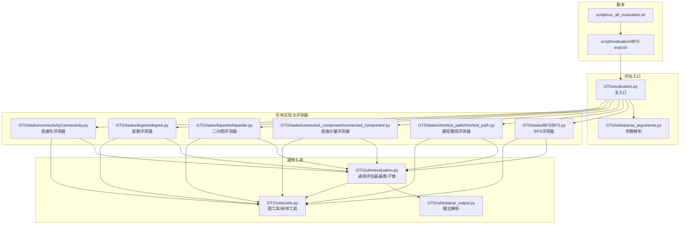
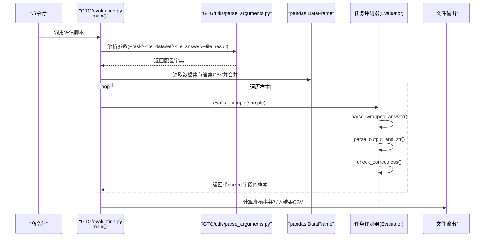
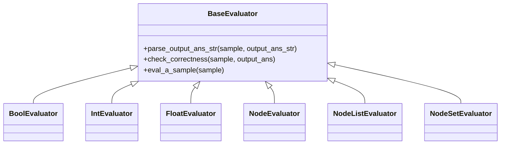
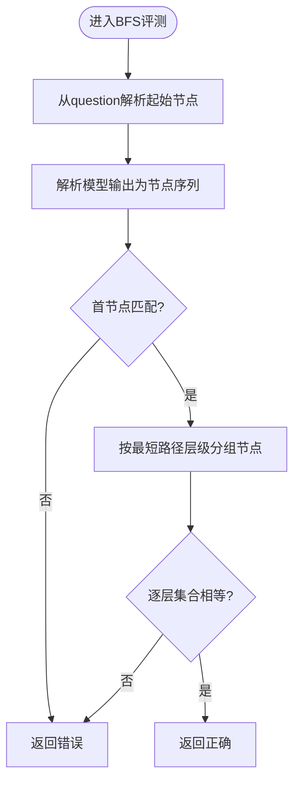
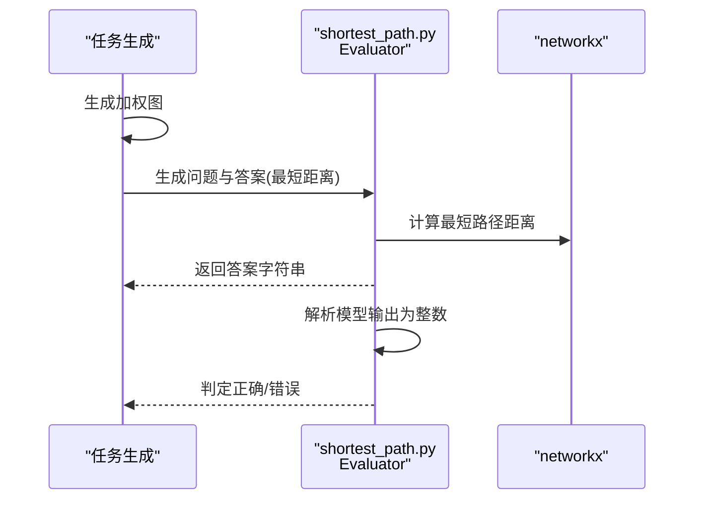
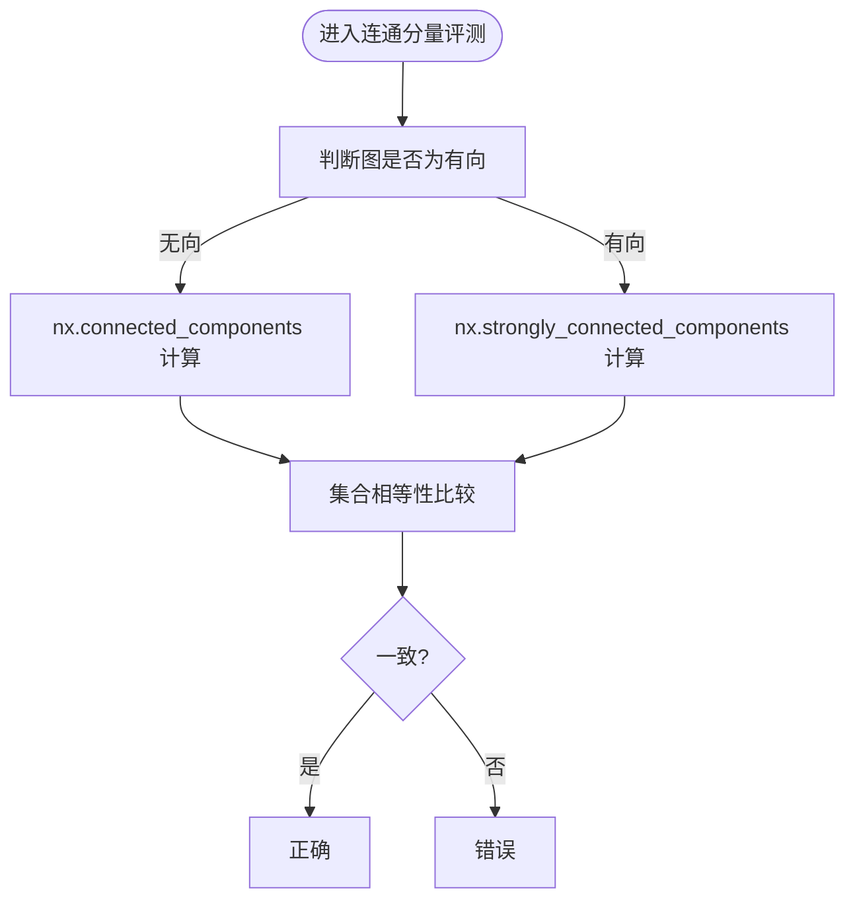
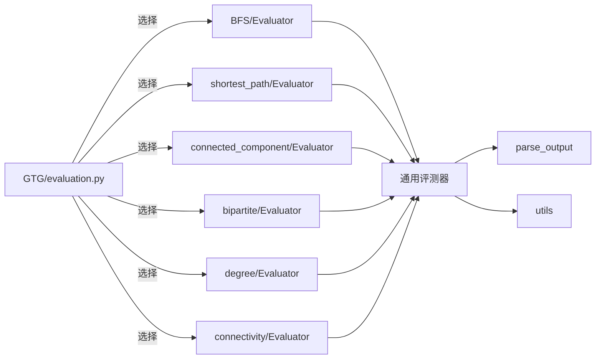

# 评估系统

<cite>
**本文引用的文件列表**
- [GTG/evaluation.py](file://GTG/evaluation.py)
- [GTG/utils/evaluation.py](file://GTG/utils/evaluation.py)
- [GTG/utils/parse_output.py](file://GTG/utils/parse_output.py)
- [GTG/utils/utils.py](file://GTG/utils/utils.py)
- [GTG/utils/parse_arguments.py](file://GTG/utils/parse_arguments.py)
- [GTG/tasks/BFS/BFS.py](file://GTG/tasks/BFS/BFS.py)
- [GTG/tasks/shortest_path/shortest_path.py](file://GTG/tasks/shortest_path/shortest_path.py)
- [GTG/tasks/connected_component/connected_component.py](file://GTG/tasks/connected_component/connected_component.py)
- [GTG/tasks/bipartite/bipartite.py](file://GTG/tasks/bipartite/bipartite.py)
- [GTG/tasks/degree/degree.py](file://GTG/tasks/degree/degree.py)
- [GTG/tasks/connectivity/connectivity.py](file://GTG/tasks/connectivity/connectivity.py)
- [script/evaluation/BFS-eval.sh](file://script/evaluation/BFS-eval.sh)
- [script/run_all_evaluation.sh](file://script/run_all_evaluation.sh)
</cite>

## 目录
1. [简介](#简介)
2. [项目结构](#项目结构)
3. [核心组件](#核心组件)
4. [架构总览](#架构总览)
5. [详细组件分析](#详细组件分析)
6. [依赖关系分析](#依赖关系分析)
7. [性能与可扩展性](#性能与可扩展性)
8. [故障排查指南](#故障排查指南)
9. [结论](#结论)
10. [附录：使用与解读](#附录使用与解读)

## 简介
本文件面向“图论任务评估系统”的使用者与维护者，系统性阐述评估流程、数据解析、正确性检查机制、指标计算与输出格式，并提供批量评估脚本的使用方法与报告解读建议。重点覆盖以下方面：
- evaluation.py 如何接收大语言模型的预测输出，并结合 GTG/tasks 中的任务算法模块计算标准答案；
- 正确性检查逻辑，例如如何验证最短路径长度、连通分量划分等；
- 评估结果的指标计算方式与输出格式；
- 使用评估脚本（如 BFS-eval.sh）进行批量评估的方法与报告解读。

## 项目结构
评估系统由三部分组成：
- 通用评估框架与解析工具：位于 GTG/utils 下，负责参数解析、输出解析、通用评估器基类与具体评测器；
- 任务实现与评测器：位于 GTG/tasks 下，每个任务包含问题生成、推理步骤生成、答案生成与对应的评测器；
- 评估入口与脚本：GTG/evaluation.py 作为主入口，配合脚本目录下的各任务评估脚本完成批量评估。

图表来源
- [GTG/evaluation.py](file://GTG/evaluation.py#L1-L73)
- [GTG/utils/parse_arguments.py](file://GTG/utils/parse_arguments.py#L1-L28)
- [GTG/utils/parse_output.py](file://GTG/utils/parse_output.py#L1-L213)
- [GTG/utils/evaluation.py](file://GTG/utils/evaluation.py#L1-L283)
- [GTG/utils/utils.py](file://GTG/utils/utils.py#L1-L617)
- [GTG/tasks/BFS/BFS.py](file://GTG/tasks/BFS/BFS.py#L1-L212)
- [GTG/tasks/shortest_path/shortest_path.py](file://GTG/tasks/shortest_path/shortest_path.py#L1-L140)
- [GTG/tasks/connected_component/connected_component.py](file://GTG/tasks/connected_component/connected_component.py#L1-L258)
- [GTG/tasks/bipartite/bipartite.py](file://GTG/tasks/bipartite/bipartite.py#L1-L135)
- [GTG/tasks/degree/degree.py](file://GTG/tasks/degree/degree.py#L1-L110)
- [GTG/tasks/connectivity/connectivity.py](file://GTG/tasks/connectivity/connectivity.py#L1-L125)
- [script/evaluation/BFS-eval.sh](file://script/evaluation/BFS-eval.sh#L1-L14)
- [script/run_all_evaluation.sh](file://script/run_all_evaluation.sh#L1-L32)

章节来源
- [GTG/evaluation.py](file://GTG/evaluation.py#L1-L73)
- [script/evaluation/BFS-eval.sh](file://script/evaluation/BFS-eval.sh#L1-L14)

## 核心组件
- 通用评估器基类与子类
  - BaseEvaluator：定义统一的解析与正确性检查接口，支持布尔、整数、浮点、节点、节点列表、节点集合等类型；
  - 各类型专用评测器：BoolEvaluator、IntEvaluator、FloatEvaluator、NodeEvaluator、NodeListEvaluator、NodeSetEvaluator；
  - 通用函数：eval_bool、eval_integer、eval_float、eval_node_in_list、eval_a_node、eval_ad_location、eval_node_set 等，用于快速评测。
- 输出解析工具
  - parse_wrapped_answer：从模型输出中提取包裹标记内的答案；
  - parse_bool、parse_first_node_id、remove_all_node_id、parse_first_integer、parse_first_float、parse_node_list、parse_list、parse_dict、parse_edge_list 等，负责不同类型的解析与清洗。
- 图与采样工具
  - make_sample、NID、graph_to_edge_list_str、edge_list_str_to_graph、graph_to_natural_language、graph_to_adj_str、graph_with_egde_weight_to_str、graph_with_egde_weight_to_adj_str、graph_with_edge_weight_to_natural_language、graph_generation、graph_generation_with_edge_weight 等，支撑任务样本构造与图表示。
- 任务评测器
  - 每个任务在 GTG/tasks/*/下提供 Evaluator 类，继承自通用评测器，重写 check_correctness 实现特定判定逻辑。

章节来源
- [GTG/utils/evaluation.py](file://GTG/utils/evaluation.py#L1-L283)
- [GTG/utils/parse_output.py](file://GTG/utils/parse_output.py#L1-L213)
- [GTG/utils/utils.py](file://GTG/utils/utils.py#L1-L617)

## 架构总览
评估流程从命令行入口开始，读取配置与数据集，合并答案与数据，逐条样本调用对应任务的评测器，最终汇总准确率并输出结果文件。

图表来源
- [GTG/evaluation.py](file://GTG/evaluation.py#L1-L73)
- [GTG/utils/parse_arguments.py](file://GTG/utils/parse_arguments.py#L1-L28)

## 详细组件分析

### 通用评估器与输出解析
- BaseEvaluator 与各类型评测器
  - eval_a_sample 统一流程：先提取包裹答案，再解析为具体类型，最后调用 check_correctness 判定正确性；
  - BoolEvaluator/IntEvaluator/FloatEvaluator：分别基于布尔、整数、浮点的解析与比较策略；
  - NodeListEvaluator/NodeSetEvaluator：列表/集合型节点答案解析与集合相等性比较；
  - 通用函数提供快速评测能力，适用于无需复杂图算法的任务。
- 输出解析
  - parse_wrapped_answer 支持 <<< >>> 包裹的答案抽取；
  - parse_bool、parse_first_node_id、parse_first_integer、parse_first_float、parse_node_list、parse_list、parse_dict、parse_edge_list 等，覆盖常见输出格式。

图表来源
- [GTG/utils/evaluation.py](file://GTG/utils/evaluation.py#L1-L283)

章节来源
- [GTG/utils/evaluation.py](file://GTG/utils/evaluation.py#L1-L283)
- [GTG/utils/parse_output.py](file://GTG/utils/parse_output.py#L1-L213)

### BFS 评测器：按层序正确性校验
- 输入：样本包含 graph、question、answer 以及模型输出；
- 关键逻辑：
  - 从 question 中解析起始节点；
  - 将模型输出解析为节点序列；
  - 以图的最短路径层级为基准，校验每层节点集合是否一致，且顺序属于该层的任意排列；
  - 若首节点不匹配或某层集合不一致，则判定错误。
- 特殊字段：当启用 DFS 任务时，会额外记录 output_path_len、output_vailid_path、output_vailid_path_len 等中间信息。

图表来源
- [GTG/tasks/BFS/BFS.py](file://GTG/tasks/BFS/BFS.py#L157-L191)

章节来源
- [GTG/tasks/BFS/BFS.py](file://GTG/tasks/BFS/BFS.py#L1-L212)

### 最短路径评测器：整数距离比较
- 输入：加权图与起点终点；
- 关键逻辑：
  - 使用 Dijkstra 算法计算起点到终点的最短距离；
  - 评测器继承 IntEvaluator，通过解析模型输出的首个整数并与标准答案比较；
  - 若解析失败或数值不一致则错误。
- 数据准备：graph_generation_with_edge_weight 为样本添加随机权重。

图表来源
- [GTG/tasks/shortest_path/shortest_path.py](file://GTG/tasks/shortest_path/shortest_path.py#L1-L140)
- [GTG/utils/evaluation.py](file://GTG/utils/evaluation.py#L69-L80)

章节来源
- [GTG/tasks/shortest_path/shortest_path.py](file://GTG/tasks/shortest_path/shortest_path.py#L1-L140)
- [GTG/utils/utils.py](file://GTG/utils/utils.py#L352-L366)

### 连通分量评测器：集合一致性校验
- 输入：图与起始节点；
- 关键逻辑：
  - 无向图：使用 nx.connected_components 计算连通分量，校验模型输出节点集合与标准一致；
  - 有向图：使用 nx.strongly_connected_components 计算强连通分量，校验集合一致；
  - 继承 NodeSetEvaluator，采用集合相等性判断。
- 可视化：Tarjan 算法与 DFS 的步骤字符串用于展示推理过程。

图表来源
- [GTG/tasks/connected_component/connected_component.py](file://GTG/tasks/connected_component/connected_component.py#L1-L258)

章节来源
- [GTG/tasks/connected_component/connected_component.py](file://GTG/tasks/connected_component/connected_component.py#L1-L258)

### 二分图评测器：边匹配合法性校验
- 输入：二分图与两个节点集合；
- 关键逻辑：
  - 解析模型输出为边列表；
  - 校验每条边两端分别属于两个集合，且每侧节点不重复；
  - 与标准答案边数一致且满足二分图匹配约束即正确。
- 数据准备：generate_bipartite_graph 生成二分图。

章节来源
- [GTG/tasks/bipartite/bipartite.py](file://GTG/tasks/bipartite/bipartite.py#L1-L135)
- [GTG/utils/utils.py](file://GTG/utils/utils.py#L408-L435)

### 度数评测器：整数度数比较
- 输入：图与目标节点；
- 关键逻辑：
  - 计算节点度数（有向图为出度），评测器继承 IntEvaluator；
  - 解析模型输出的首个整数并与标准答案比较；
  - 零度样本比例受控，避免极端分布。

章节来源
- [GTG/tasks/degree/degree.py](file://GTG/tasks/degree/degree.py#L1-L110)
- [GTG/utils/evaluation.py](file://GTG/utils/evaluation.py#L69-L80)

### 连通性评测器：布尔路径存在性
- 输入：图与起点终点；
- 关键逻辑：
  - 使用 DFS 搜索可达性，评测器继承 BoolEvaluator；
  - 解析模型输出的布尔值并与标准答案比较；
  - 样本中 Yes/No 比例受控，避免偏向。

章节来源
- [GTG/tasks/connectivity/connectivity.py](file://GTG/tasks/connectivity/connectivity.py#L1-L125)
- [GTG/utils/evaluation.py](file://GTG/utils/evaluation.py#L56-L80)

## 依赖关系分析
- 任务评测器与通用评估器的耦合
  - 各任务评测器均继承自通用评测器基类，复用解析与正确性检查框架；
  - 通过 parse_output 工具链实现跨任务的统一输出解析。
- 任务与图工具
  - 任务评测器依赖 utils 提供的图构造、转换与自然语言描述工具；
  - 评测器内部可能使用 networkx 进行图算法计算（如 BFS 层级、最短路径、连通分量）。
- 入口与脚本
  - GTG/evaluation.py 作为主入口，根据 --task 参数选择对应任务评测器；
  - 脚本负责组织输入输出路径并调用主入口。

图表来源
- [GTG/evaluation.py](file://GTG/evaluation.py#L1-L73)
- [GTG/utils/evaluation.py](file://GTG/utils/evaluation.py#L1-L283)
- [GTG/utils/parse_output.py](file://GTG/utils/parse_output.py#L1-L213)
- [GTG/utils/utils.py](file://GTG/utils/utils.py#L1-L617)

章节来源
- [GTG/evaluation.py](file://GTG/evaluation.py#L1-L73)

## 性能与可扩展性
- 性能特征
  - 评测器主要瓶颈在于图算法（如 BFS 层级遍历、Dijkstra、连通分量计算），时间复杂度通常为 O(V+E) 或更高；
  - pandas 合并与逐样本评测在大规模数据上可能成为瓶颈，建议分批处理或并行化；
  - 输出解析与正则匹配开销较小，但需注意包裹标记与节点ID清洗的健壮性。
- 可扩展性
  - 新增任务只需在 GTG/tasks 下新增目录与 Evaluator 类，继承合适的评测器基类并实现 check_correctness；
  - 通用评测器与解析工具可复用，降低重复开发成本；
  - 建议为复杂任务增加可视化步骤字符串，便于调试与报告呈现。

[本节为通用指导，不直接分析具体文件]

## 故障排查指南
- 评测结果全为 0
  - 检查模型输出是否被包裹在 <<< >>> 内，或是否包含节点ID标记；
  - 确认 parse_wrapped_answer 是否能正确提取答案；
  - 参考：[GTG/utils/parse_output.py](file://GTG/utils/parse_output.py#L1-L25)
- 解析失败导致 correct 为 0
  - 检查输出中是否存在整数/浮点/节点列表等格式；
  - 参考：[GTG/utils/parse_output.py](file://GTG/utils/parse_output.py#L56-L118)
- BFS 评测错误
  - 确认起始节点与输出序列首节点一致；
  - 确认每层节点集合与标准一致；
  - 参考：[GTG/tasks/BFS/BFS.py](file://GTG/tasks/BFS/BFS.py#L157-L191)
- 连通分量评测错误
  - 有向图与无向图的判定是否正确；
  - 输出节点集合是否与标准一致；
  - 参考：[GTG/tasks/connected_component/connected_component.py](file://GTG/tasks/connected_component/connected_component.py#L1-L258)
- 二分图评测错误
  - 边是否跨集合且两侧节点不重复；
  - 参考：[GTG/tasks/bipartite/bipartite.py](file://GTG/tasks/bipartite/bipartite.py#L94-L135)
- 连通性评测错误
  - DFS 可达性是否正确；
  - 参考：[GTG/tasks/connectivity/connectivity.py](file://GTG/tasks/connectivity/connectivity.py#L1-L125)

章节来源
- [GTG/utils/parse_output.py](file://GTG/utils/parse_output.py#L1-L213)
- [GTG/tasks/BFS/BFS.py](file://GTG/tasks/BFS/BFS.py#L157-L191)
- [GTG/tasks/connected_component/connected_component.py](file://GTG/tasks/connected_component/connected_component.py#L1-L258)
- [GTG/tasks/bipartite/bipartite.py](file://GTG/tasks/bipartite/bipartite.py#L94-L135)
- [GTG/tasks/connectivity/connectivity.py](file://GTG/tasks/connectivity/connectivity.py#L1-L125)

## 结论
评估系统通过统一的评测器基类与解析工具，实现了对多种图论任务的标准化评测。BFS 评测器采用层级一致性校验，最短路径评测器采用整数比较，连通分量评测器采用集合一致性校验，二分图评测器采用边匹配合法性校验，连通性评测器采用布尔路径存在性校验。整体流程清晰、可扩展性强，适合在大规模数据上进行批量评估与报告生成。

[本节为总结，不直接分析具体文件]

## 附录：使用与解读

### 使用评估脚本进行批量评估
- 单任务评估示例（以 BFS 为例）
  - 脚本位置：script/evaluation/BFS-eval.sh
  - 调用方式：bash script/evaluation/BFS-eval.sh <数据根目录> <输出根目录>
  - 参数说明：
    - data_root：包含任务数据的根目录（如 BFS-int_id.csv）；
    - output_root：包含任务输出与结果的根目录（如 BFS-output.csv、BFS-results.csv）。
  - 脚本内部会调用 python -m GTG.evaluation 并传入 --task、--file_dataset、--file_answer、--file_result 等参数。
- 批量评估
  - script/run_all_evaluation.sh 提供了批量执行多个任务评估脚本的示例，可根据需要取消注释相应行。

章节来源
- [script/evaluation/BFS-eval.sh](file://script/evaluation/BFS-eval.sh#L1-L14)
- [script/run_all_evaluation.sh](file://script/run_all_evaluation.sh#L1-L32)
- [GTG/evaluation.py](file://GTG/evaluation.py#L1-L73)
- [GTG/utils/parse_arguments.py](file://GTG/utils/parse_arguments.py#L1-L28)

### 评估结果指标与输出格式
- 指标计算
  - 准确率：所有样本的 correct 字段均值；
  - 其他中间字段：如 BFS 任务在启用 DFS 时会记录 output_path_len、output_vailid_path、output_vailid_path_len 等。
- 输出文件
  - 文件名：由 --file_result 指定；
  - 内容：包含 "# accuracy: ..." 注释行与完整的 CSV 表格（含原数据列、解析后列与 correct）。
- 结果解读建议
  - 关注准确率趋势与任务分布（如 BFS 的层级一致性、最短路径的距离误差容忍度、连通分量的集合一致性等）；
  - 对于解析失败较多的任务，检查模型输出格式与包裹标记是否规范；
  - 对于特定任务（如 BFS），可结合中间字段定位错误原因（首节点不匹配、层级集合不一致等）。

章节来源
- [GTG/evaluation.py](file://GTG/evaluation.py#L38-L68)