# 项目概述

<cite>
**本文引用的文件列表**
- [README.md](file://README.md)
- [generation.py](file://GTG/generation.py)
- [evaluation.py](file://GTG/evaluation.py)
- [utils.py](file://GTG/utils/utils.py)
- [parse_arguments.py](file://GTG/utils/parse_arguments.py)
- [evaluation_utils.py](file://GTG/utils/evaluation.py)
- [BFS.py](file://GTG/tasks/BFS/BFS.py)
- [DFS.py](file://GTG/tasks/DFS/DFS.py)
- [shortest_path.py](file://GTG/tasks/shortest_path/shortest_path.py)
- [page_rank.py](file://GTG/tasks/page_rank/page_rank.py)
- [int_id.py](file://GTG/process_node_id/int_id.py)
- [letter_id.py](file://GTG/process_node_id/letter_id.py)
- [process_node_id_main.py](file://GTG/process_node_id/main.py)
- [run_all_generation.sh](file://script/run_all_generation.sh)
- [README.md（LLaMAFactory）](file://LLaMAFactory/README.md)
</cite>

## 目录
1. [引言](#引言)
2. [项目结构](#项目结构)
3. [核心组件](#核心组件)
4. [架构总览](#架构总览)
5. [详细组件分析](#详细组件分析)
6. [依赖关系分析](#依赖关系分析)
7. [性能考量](#性能考量)
8. [故障排查指南](#故障排查指南)
9. [结论](#结论)
10. [附录](#附录)

## 引言
GraphInstruct 是一个面向大语言模型（LLM）的图论算法数据集生成与评估工具，旨在通过动态生成高质量的图结构问答样本，提升模型对图结构数据的理解与推理能力。项目围绕“任务驱动”的数据生成流程，提供统一的图生成器、任务模板、节点ID映射与解析、以及标准化的评估体系；同时与 LLaMAFactory 集成，支持基于该数据集进行监督微调（SFT）与推理部署。

本项目的核心目标：
- 动态生成多类图论任务的数据集（如 BFS/DFS、最短路径、PageRank、欧拉/哈密尔顿路径等），覆盖节点序列、布尔判断、数值计算、集合匹配等多种输出形式。
- 提供可复用的任务模板与评估器，确保生成样本的正确性与一致性。
- 支持节点ID从数字到字母的可配置映射，便于人类可读与模型可解析的平衡。
- 与 LLaMAFactory 深度集成，支持训练与推理链路的无缝衔接。

## 项目结构
项目采用模块化分层组织：
- GTG：核心数据生成与评估模块，包含通用工具、任务模板、节点ID映射与评估器。
- script：批量运行脚本，一键生成各类任务的数据集。
- LLaMAFactory：训练与推理框架，用于加载 GraphInstruct 数据集进行模型微调与评测。

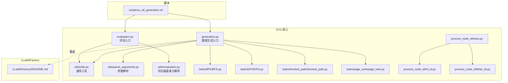

图表来源
- [generation.py](file://GTG/generation.py#L1-L107)
- [evaluation.py](file://GTG/evaluation.py#L1-L73)
- [utils.py](file://GTG/utils/utils.py#L1-L617)
- [parse_arguments.py](file://GTG/utils/parse_arguments.py#L1-L28)
- [evaluation_utils.py](file://GTG/utils/evaluation.py#L1-L283)
- [BFS.py](file://GTG/tasks/BFS/BFS.py#L1-L212)
- [DFS.py](file://GTG/tasks/DFS/DFS.py#L1-L333)
- [shortest_path.py](file://GTG/tasks/shortest_path/shortest_path.py#L1-L140)
- [page_rank.py](file://GTG/tasks/page_rank/page_rank.py#L1-L129)
- [int_id.py](file://GTG/process_node_id/int_id.py#L1-L21)
- [letter_id.py](file://GTG/process_node_id/letter_id.py#L1-L33)
- [process_node_id_main.py](file://GTG/process_node_id/main.py#L1-L58)
- [run_all_generation.sh](file://script/run_all_generation.sh#L1-L72)
- [README.md（LLaMAFactory）](file://LLaMAFactory/README.md#L1-L200)

章节来源
- [README.md](file://README.md#L1-L90)
- [run_all_generation.sh](file://script/run_all_generation.sh#L1-L72)

## 核心组件
- 数据生成器（generation.py）
  - 负责解析命令行参数、选择任务模块、生成样本、统计描述信息并保存为 CSV。
  - 关键流程：参数解析 → 任务模块选择 → 生成样本示例 → 批量生成 → 统计与保存。
- 评估器（evaluation.py）
  - 负责加载答案与数据集，合并后逐条评估，输出准确率与结果汇总。
  - 关键流程：参数解析 → 选择评估器 → 合并数据 → 逐条评估 → 计算准确率 → 写入结果。
- 通用工具（utils/utils.py）
  - 提供随机种子设置、样本构造、图结构序列化/反序列化、节点ID格式化、图生成策略（随机/BA/Watts-Strogatz）、权重图生成、DAG/二部图/哈密尔顿/欧拉路径图生成等。
- 参数解析（utils/parse_arguments.py）
  - 统一解析任务名、输入输出路径、随机种子、节点ID类型、采样规模等。
- 评估器基类与解析（utils/evaluation.py）
  - 定义基础评估流程（解析输出字符串 → 解析为具体答案 → 判定正确性），并提供布尔、整数、浮点、节点列表/集合等评估器。
- 任务模板（tasks/*）
  - 每个任务包含问题生成、推理步骤生成、答案生成、可选的选择题生成与评估器。
- 节点ID映射（process_node_id/*）
  - 将内部格式的节点ID（如 <0>, <1>…）映射为数字或字母，支持批量重写数据集中的图表示与答案字段。
- 批量运行脚本（script/run_all_generation.sh）
  - 一键批量执行各任务的生成脚本，支持不同规模与标签的数据集生成。

章节来源
- [generation.py](file://GTG/generation.py#L1-L107)
- [evaluation.py](file://GTG/evaluation.py#L1-L73)
- [utils.py](file://GTG/utils/utils.py#L1-L617)
- [parse_arguments.py](file://GTG/utils/parse_arguments.py#L1-L28)
- [evaluation_utils.py](file://GTG/utils/evaluation.py#L1-L283)
- [BFS.py](file://GTG/tasks/BFS/BFS.py#L1-L212)
- [DFS.py](file://GTG/tasks/DFS/DFS.py#L1-L333)
- [shortest_path.py](file://GTG/tasks/shortest_path/shortest_path.py#L1-L140)
- [page_rank.py](file://GTG/tasks/page_rank/page_rank.py#L1-L129)
- [int_id.py](file://GTG/process_node_id/int_id.py#L1-L21)
- [letter_id.py](file://GTG/process_node_id/letter_id.py#L1-L33)
- [process_node_id_main.py](file://GTG/process_node_id/main.py#L1-L58)
- [run_all_generation.sh](file://script/run_all_generation.sh#L1-L72)

## 架构总览
下图展示了从命令行到数据生成、评估与模型训练的整体流程。

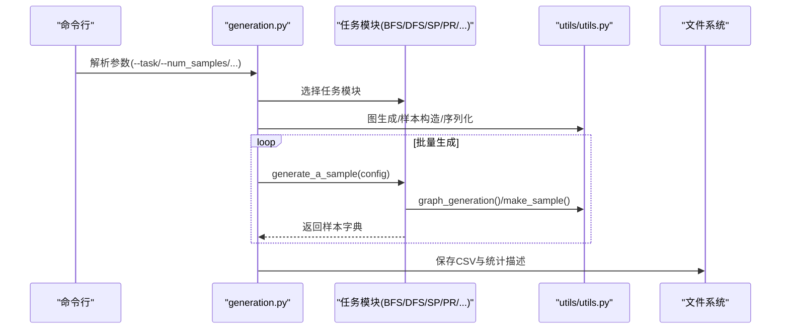

图表来源
- [generation.py](file://GTG/generation.py#L1-L107)
- [utils.py](file://GTG/utils/utils.py#L1-L617)
- [BFS.py](file://GTG/tasks/BFS/BFS.py#L1-L212)
- [DFS.py](file://GTG/tasks/DFS/DFS.py#L1-L333)
- [shortest_path.py](file://GTG/tasks/shortest_path/shortest_path.py#L1-L140)
- [page_rank.py](file://GTG/tasks/page_rank/page_rank.py#L1-L129)

## 详细组件分析

### 数据生成器（generation.py）
- 输入：命令行参数（任务名、样本数量、节点范围、随机种子等）。
- 输出：CSV 格式数据集，包含图结构、问题、答案、推理步骤、统计信息。
- 关键点：
  - 任务模块映射：根据任务名动态导入对应模块。
  - 样本示例预览与批量生成：先打印示例，再批量生成并保存。
  - 统计信息：计算平均度、是否为有向图、平均度/节点比等，并导出描述性统计。

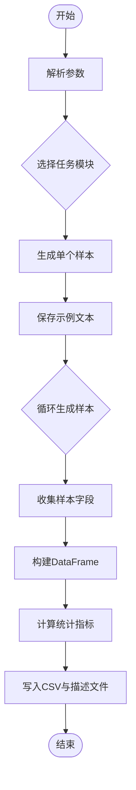

图表来源
- [generation.py](file://GTG/generation.py#L1-L107)

章节来源
- [generation.py](file://GTG/generation.py#L1-L107)

### 评估器（evaluation.py）
- 输入：数据集CSV与模型输出CSV（包含 id 与 output 两列）。
- 输出：合并后的结果与准确率。
- 关键点：
  - 评估器映射：按任务名选择对应评估器。
  - 合并数据：以 id 为键合并答案与模型输出。
  - 逐条评估：调用评估器的 eval_a_sample 流程，记录正确性与中间解析结果。

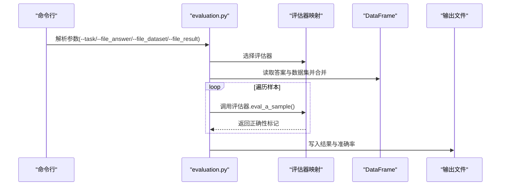

图表来源
- [evaluation.py](file://GTG/evaluation.py#L1-L73)
- [evaluation_utils.py](file://GTG/utils/evaluation.py#L1-L283)

章节来源
- [evaluation.py](file://GTG/evaluation.py#L1-L73)
- [evaluation_utils.py](file://GTG/utils/evaluation.py#L1-L283)

### 通用工具（utils/utils.py）
- 随机性控制：统一设置随机种子，保证可复现性。
- 样本构造：将图对象序列化为边列表、邻接表、自然语言描述等格式。
- 图生成策略：
  - 随机图（GNP）、Barabási–Albert、Watts–Strogatz。
  - 带权重的图生成。
  - DAG、二部图、哈密尔顿/欧拉路径图等特殊图。
- 节点ID格式化与转换：提供 NID 格式化与字符串解析辅助函数。
- 辅助函数：检查孤立节点、随机重映射节点ID、打乱边顺序等。

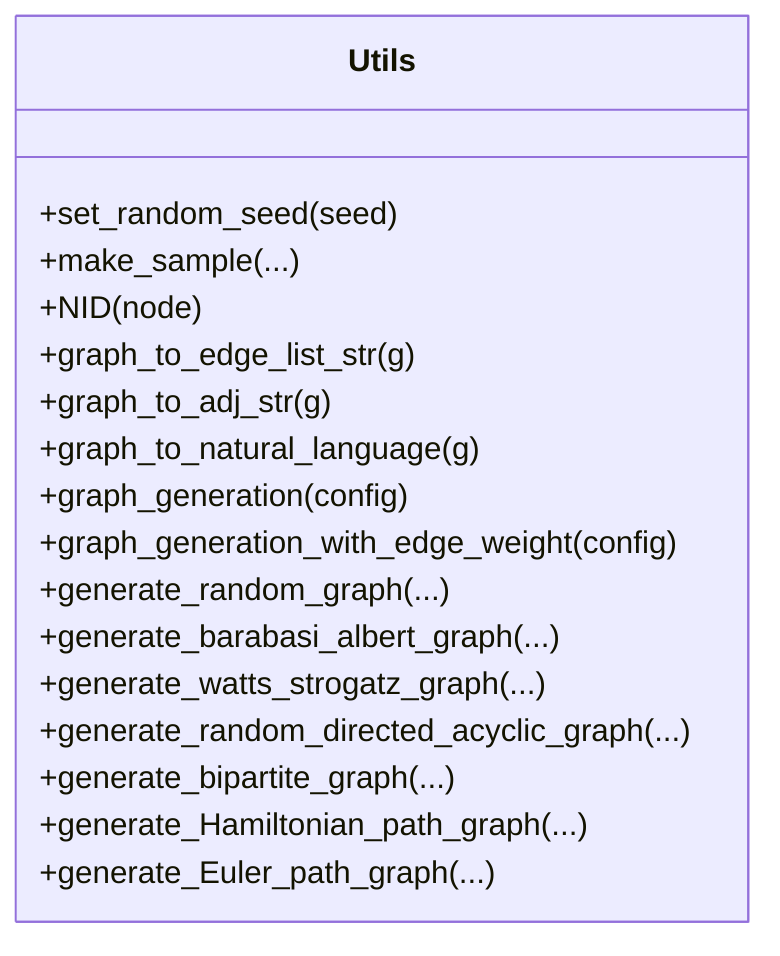

图表来源
- [utils.py](file://GTG/utils/utils.py#L1-L617)

章节来源
- [utils.py](file://GTG/utils/utils.py#L1-L617)

### 评估器基类与解析（utils/evaluation.py）
- 基类流程：解析输出字符串 → 解析为具体答案 → 判定正确性。
- 评估器类型：
  - 布尔型：Yes/No 等判断。
  - 整数型：解析第一个整数并比较。
  - 浮点型：允许一定误差比例。
  - 节点/节点列表/节点集合：校验集合相等或包含关系。
- 公共解析工具：从输出中提取节点集合、布尔值、首个整数/浮点数、节点列表等。

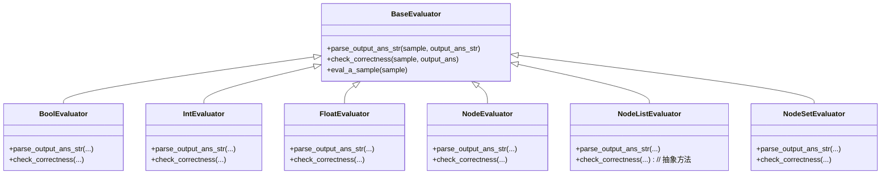

图表来源
- [evaluation_utils.py](file://GTG/utils/evaluation.py#L1-L283)

章节来源
- [evaluation_utils.py](file://GTG/utils/evaluation.py#L1-L283)

### 任务模板：BFS/DFS
- BFS
  - 问题生成：指定起始节点，要求输出广度优先遍历序列。
  - 答案与推理步骤：逐步展示访问过程与未访问邻居。
  - 评估器：校验序列是否满足层次遍历约束（按 hop 分组节点集合一致）。
- DFS
  - 问题生成：指定起始节点，要求输出深度优先遍历序列。
  - 答案与推理步骤：逐步展示访问与栈状态。
  - 评估器：自定义路径合法性判定，检查每一步是否符合 DFS 的邻接与回溯规则。

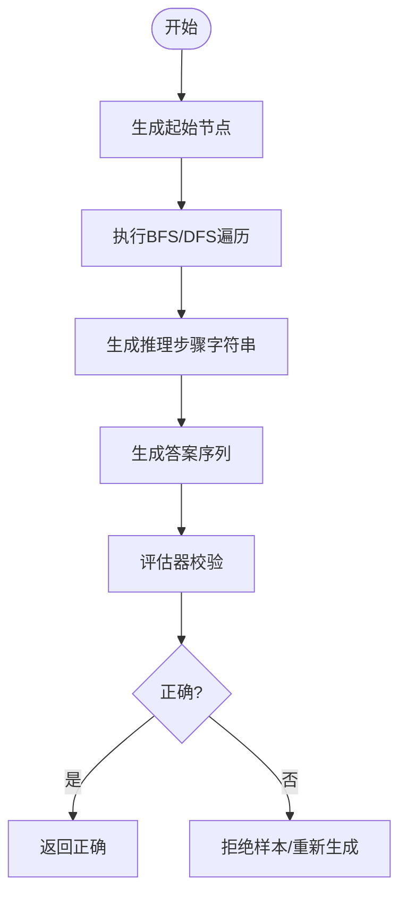

图表来源
- [BFS.py](file://GTG/tasks/BFS/BFS.py#L1-L212)
- [DFS.py](file://GTG/tasks/DFS/DFS.py#L1-L333)

章节来源
- [BFS.py](file://GTG/tasks/BFS/BFS.py#L1-L212)
- [DFS.py](file://GTG/tasks/DFS/DFS.py#L1-L333)

### 任务模板：最短路径（Shortest Path）
- 问题生成：给出起点与终点，要求输出最短距离。
- 答案与推理步骤：使用 Dijkstra 算法逐步更新未访问节点距离，最终输出最短距离。
- 评估器：整数型评估器，比较解析出的整数与期望答案。

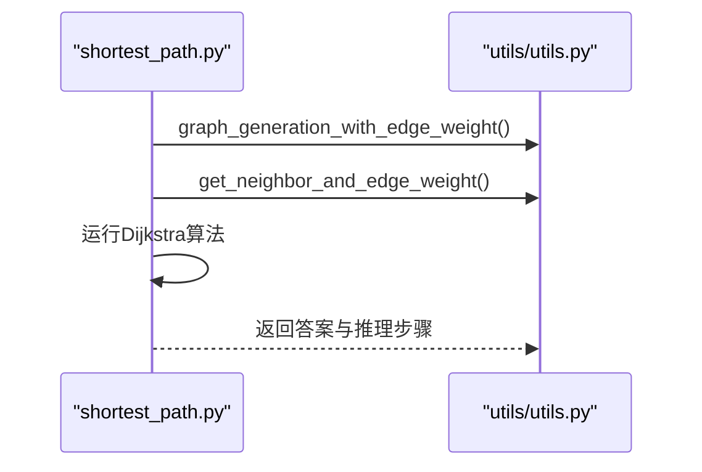

图表来源
- [shortest_path.py](file://GTG/tasks/shortest_path/shortest_path.py#L1-L140)
- [utils.py](file://GTG/utils/utils.py#L1-L617)

章节来源
- [shortest_path.py](file://GTG/tasks/shortest_path/shortest_path.py#L1-L140)
- [utils.py](file://GTG/utils/utils.py#L1-L617)

### 任务模板：PageRank
- 问题生成：询问具有最大 PageRank 值的节点（给出阻尼因子与迭代次数）。
- 答案与推理步骤：展示归一化邻接矩阵、转移概率矩阵与多次迭代后的结果。
- 评估器：节点集合评估器，允许输出集合中任一正确节点即视为正确。

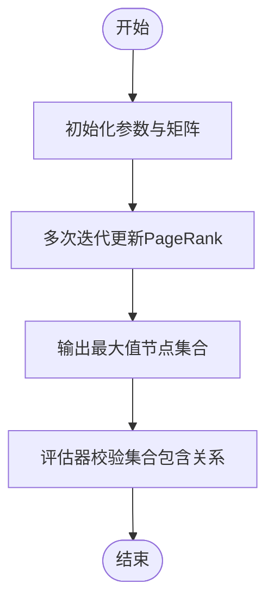

图表来源
- [page_rank.py](file://GTG/tasks/page_rank/page_rank.py#L1-L129)

章节来源
- [page_rank.py](file://GTG/tasks/page_rank/page_rank.py#L1-L129)

### 节点ID管理（process_node_id/*）
- 数字ID映射：将内部格式 <0>, <1>… 映射为纯数字字符串。
- 字母ID映射：将内部格式映射为固定长度的大写字母组合。
- 批量重写：读取 CSV，对 graph/graph_adj/graph_nl/nodes/question/answer 等字段进行统一替换，保持答案树（如 MST）与选择项（如 ad_location）的兼容。

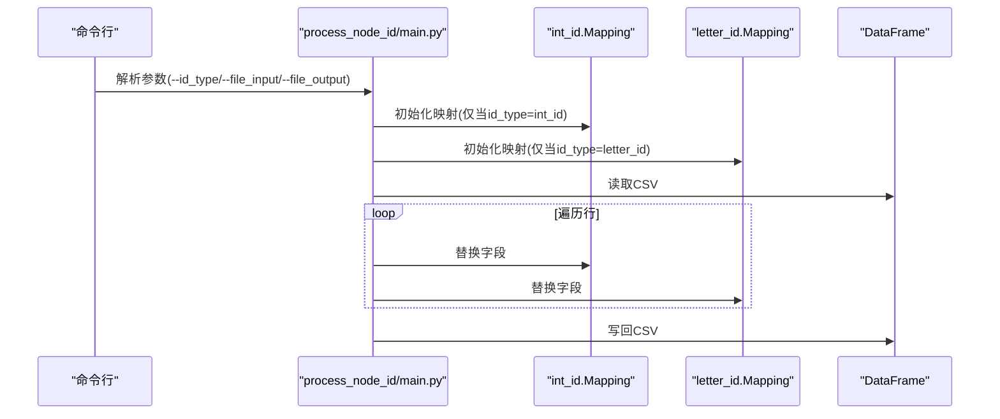

图表来源
- [process_node_id_main.py](file://GTG/process_node_id/main.py#L1-L58)
- [int_id.py](file://GTG/process_node_id/int_id.py#L1-L21)
- [letter_id.py](file://GTG/process_node_id/letter_id.py#L1-L33)

章节来源
- [process_node_id_main.py](file://GTG/process_node_id/main.py#L1-L58)
- [int_id.py](file://GTG/process_node_id/int_id.py#L1-L21)
- [letter_id.py](file://GTG/process_node_id/letter_id.py#L1-L33)

### 与 LLaMAFactory 的集成
- 数据准备：GraphInstruct 生成的数据集可直接用于 LLaMAFactory 的 SFT 训练流程。
- 训练入口：在 LLaMAFactory 目录下通过 run.sh 或示例配置启动训练。
- 注意事项：需调整实验配置文件（如 examples/train_reasoning/llama3_lora_sft.yaml）以适配 GraphInstruct 数据格式。

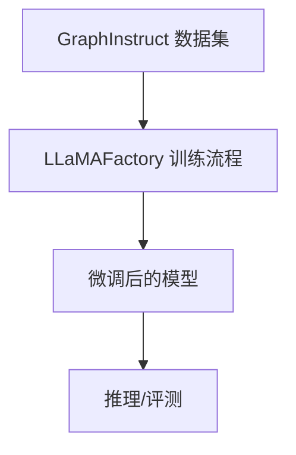

图表来源
- [README.md](file://README.md#L45-L90)
- [README.md（LLaMAFactory）](file://LLaMAFactory/README.md#L470-L520)

章节来源
- [README.md](file://README.md#L45-L90)
- [README.md（LLaMAFactory）](file://LLaMAFactory/README.md#L470-L520)

## 依赖关系分析
- 模块耦合
  - generation.py 与 tasks/* 强耦合：通过任务名映射到具体任务模块。
  - evaluation.py 与 tasks/* 强耦合：通过任务名映射到评估器。
  - utils/utils.py 为全局工具库，被 generation.py、tasks/*、evaluation.py 广泛使用。
  - process_node_id/* 与 generation.py/evaluation.py 解耦，通过命令行参数选择使用。
- 外部依赖
  - NetworkX：图结构生成与操作。
  - Pandas：数据读写与合并。
  - NumPy：数值计算与随机性。
  - tqdm：进度条显示。

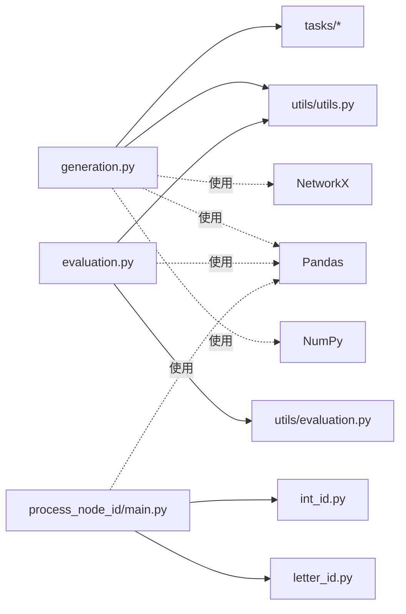

图表来源
- [generation.py](file://GTG/generation.py#L1-L107)
- [evaluation.py](file://GTG/evaluation.py#L1-L73)
- [utils.py](file://GTG/utils/utils.py#L1-L617)
- [evaluation_utils.py](file://GTG/utils/evaluation.py#L1-L283)
- [process_node_id_main.py](file://GTG/process_node_id/main.py#L1-L58)
- [int_id.py](file://GTG/process_node_id/int_id.py#L1-L21)
- [letter_id.py](file://GTG/process_node_id/letter_id.py#L1-L33)

章节来源
- [generation.py](file://GTG/generation.py#L1-L107)
- [evaluation.py](file://GTG/evaluation.py#L1-L73)
- [utils.py](file://GTG/utils/utils.py#L1-L617)
- [evaluation_utils.py](file://GTG/utils/evaluation.py#L1-L283)
- [process_node_id_main.py](file://GTG/process_node_id/main.py#L1-L58)
- [int_id.py](file://GTG/process_node_id/int_id.py#L1-L21)
- [letter_id.py](file://GTG/process_node_id/letter_id.py#L1-L33)

## 性能考量
- 生成效率
  - 批量生成时使用进度条与向量化操作，减少 IO 开销。
  - 图生成策略包含拒绝采样与重试逻辑，避免无效样本（如孤立节点、极端度分布）。
- 评估效率
  - 评估器采用字符串解析与集合比较，复杂度与样本规模线性相关。
  - BFS/DFS 评估器对路径合法性进行分段校验，避免全量回溯。
- 可扩展性
  - 新增任务只需实现 generate_a_sample 与可选评估器，并在映射中注册即可。
  - 节点ID映射支持数字与字母两种方式，便于不同场景的人类可读性与模型稳定性平衡。

[本节为通用指导，不直接分析具体文件]

## 故障排查指南
- 生成失败或样本质量差
  - 检查图生成策略是否导致极端度或孤立节点：utils 中包含拒绝采样与重试逻辑。
  - 调整 num_nodes_range 与 link_prob，确保图连通且度分布合理。
- 评估不通过
  - 确认输出格式与评估器期望一致（整数/浮点/布尔/节点列表/集合）。
  - 对于 BFS/DFS，确认起始节点与输出序列首元素一致，且满足层次/邻接约束。
- 节点ID不一致
  - 使用 process_node_id/main.py 对数据集进行统一映射，确保 graph/graph_adj/graph_nl/nodes/question/answer 等字段一致。
- 训练问题
  - 在 LLaMAFactory 中核对数据格式（CSV列名与内容），并检查示例配置文件中的路径与参数。

章节来源
- [utils.py](file://GTG/utils/utils.py#L1-L617)
- [evaluation_utils.py](file://GTG/utils/evaluation.py#L1-L283)
- [process_node_id_main.py](file://GTG/process_node_id/main.py#L1-L58)
- [README.md（LLaMAFactory）](file://LLaMAFactory/README.md#L470-L520)

## 结论
GraphInstruct 通过模块化的数据生成与评估体系，为大语言模型提供了高质量的图论任务数据集，并与 LLaMAFactory 实现了顺畅的训练与推理集成。其设计强调可扩展性与可复现性：新增任务只需遵循统一接口，评估流程标准化，节点ID映射灵活可控。对于初学者，建议从 BFS/DFS 与最短路径等基础任务入手；对于高级用户，可基于现有工具链扩展更复杂的图算法任务，并结合 LLaMAFactory 进行端到端的模型训练与评测。

[本节为总结性内容，不直接分析具体文件]

## 附录
- 典型应用场景
  - BFS/DFS 数据集生成与模型推理评估：通过 run_all_generation.sh 一键生成 mini/small 数据集，随后使用 evaluation.py 进行评估。
  - PageRank 与最短路径：验证模型对中心性与路径规划的理解能力。
  - 节点ID映射：在人类可读与模型稳定之间取得平衡，适用于教学与评测场景。
- 快速上手
  - 安装 GTG 子包后，修改 run_all_generation.sh 中的 project_root 与数据标签，即可批量生成数据集。
  - 在 LLaMAFactory 中加载生成的数据集，按照示例配置启动训练。

章节来源
- [run_all_generation.sh](file://script/run_all_generation.sh#L1-L72)
- [README.md](file://README.md#L1-L90)